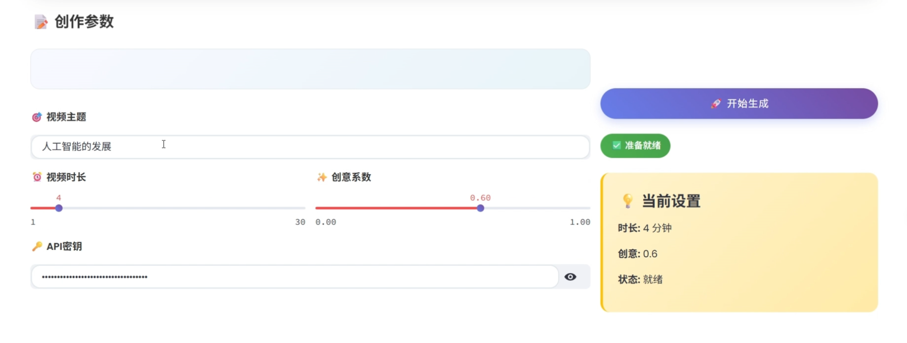

---
# 核心元数据
author: lanshi
date: "2025-07-06T23:18:00+08:00"
lastmod:
title: 视频脚本一键生成器

# 内容控制
draft: false
showToc: true
tocOpen: false
showFullContent: true
summary: 本文介绍了如何使用大模型和维基百科API生成视频脚本，包括创建项目及安装依赖项、创建AI请求以及创建网站页面的详细步骤。

# 内容分类
series:
tags: ["AI", "Python", "LangChain", "Streamlit", "视频脚本"]
categories: ["编程"]

# SEO优化
description: 本文介绍了如何使用大模型和维基百科API生成视频脚本，包括创建项目及安装依赖项、创建AI请求以及创建网站页面的详细步骤。
keywords: ["AI", "Python", "LangChain", "Streamlit", "视频脚本", "维基百科API", "大模型"]

# 主题集成
math: true
comment: true
hiddenFromSearch: false
hiddenFromHomePage: false

# 视觉配置
cover:
  image: "video-script-generator-cover.png"
  alt: "视频脚本一键生成器封面"
  caption: "视频脚本一键生成器"
  relative: true

# 版权声明
copyright: true
---
## 演示视频



## GitHub地址

[](https://github.com/lanshi17/AI-Script-generator/tree/master/%E8%A7%86%E9%A2%91%E8%84%9A%E6%9C%AC%E4%B8%80%E9%94%AE%E7%94%9F%E6%88%90%E5%99%A8)



一个年轻、清爽、多样化的AI视频脚本生成工具，专为Z世代创作者打造！

## ✨ 设计特色

- � **年轻清爽**：渐变色彩，活力满满
- 🧹 **整齐干净**：卡片式布局，层次分明  
- 🚀 **多样化交互**：丰富的视觉元素和动效
- 📱 **响应式设计**：完美适配各种设备

## 🌟 功能亮点

- 🎯 **智能分析**：AI深度理解主题内容
- ⚡ **秒速生成**：快速创作专业脚本
- 🎨 **创意无限**：可调节创意系数
- � **质量保证**：结构化输出，专业水准

## 🚀 快速开始

### 方法1：一键启动

```bash
# 双击启动文件
start.bat
```

### 方法2：Python启动

```bash
python run.py
```

### 方法3：直接运行

```bash
streamlit run main.py --server.port 8501
```

## 📱 使用指南

1. **🎯 输入主题** - 描述你的视频创意
2. **⏰ 设置时长** - 选择合适的视频长度
3. **✨ 调节创意** - 控制内容的创新程度
4. **🔑 配置密钥** - 输入API密钥
5. **🚀 开始生成** - 等待AI为你创作
6. **📥 获取结果** - 下载或复制脚本

## 🎨 界面预览

```
┌─────────────────────────────────────────────────────┐
│                🎬 AI脚本生成器                        │
│            年轻人的创意工具，让视频制作更轻松！          │
├─────────────────────────────────────────────────────┤
│  🚀快速生成  🎨创意无限  📱简单易用  💎质量保证      │
├─────────────────────────────────────────────────────┤
│                   📝 创作参数                       │
│  ┌─────────────────────┐  ┌─────────────────────┐    │
│  │ 🎯 [视频主题输入]    │  │                     │    │
│  │                     │  │   🚀 开始生成        │    │
│  │ ⏰时长  ✨创意系数   │  │                     │    │
│  │                     │  │   ✅ 准备就绪        │    │
│  │ 🔑 [API密钥]        │  │                     │    │
│  └─────────────────────┘  │   💡 当前设置        │    │
│                           └─────────────────────┘    │
└─────────────────────────────────────────────────────┘
```

## 🛠️ 技术栈

- **前端框架**: Streamlit
- **UI设计**: CSS3 + Poppins字体
- **后端逻辑**: Python
- **AI引擎**: LangChain + OpenAI
- **数据源**: Wikipedia API

## 📂 项目结构

```
🎬 AI脚本生成器/
├── 📄 main.py          # 主应用（年轻清爽版）
├── 🔧 utils.py         # 核心工具函数
├── 🚀 run.py           # Python启动脚本
├── 📱 start.bat        # 一键启动脚本
├── 📋 requirements.txt # 项目依赖
├── 📖 README.md        # 项目说明
├── 🧪 example.py       # 使用示例
├── ⚙️ pytest.ini       # 测试配置
└── 📁 tests/           # 测试文件夹
    └── 🧪 test_core.py
```

## 🎯 特色功能

### 🎨 年轻化设计

- 渐变色按钮和背景
- 圆角卡片布局
- 现代化图标和emoji
- 流畅的动画效果

### 🚀 智能交互

- 实时状态反馈
- 进度条动画
- 气球庆祝效果
- 智能错误提示

### 📱 响应式体验

- 移动端友好
- 自适应布局
- 触摸优化
- 快速加载

## 🔧 配置说明

- **视频时长**: 1-30分钟可调
- **创意系数**: 0.0-1.0精细控制
- **API支持**: OpenAI兼容接口
- **多端访问**: 支持局域网访问

## 🎉 更新日志

### v2.0 - 年轻清爽版

- 🎨 全新UI设计，年轻化风格
- 🚀 优化用户体验
- 📱 增强移动端适配
- 💎 提升视觉质量

### v1.0 - 奢华极简版  

- ⚫ 黑白经典设计
- 🔲 极简布局风格
- 📝 基础功能实现

---

*🎬 让每个年轻人都能轻松创作出优质视频内容！*
