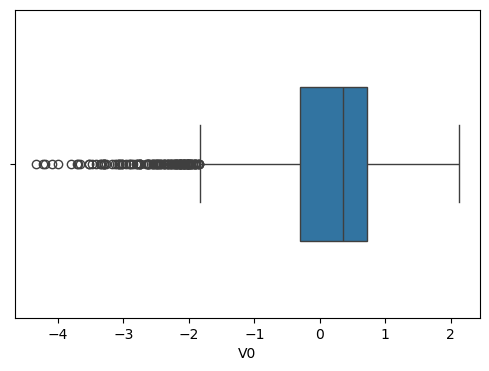
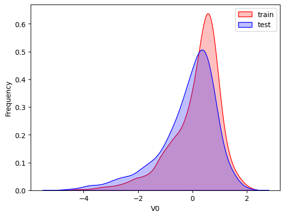
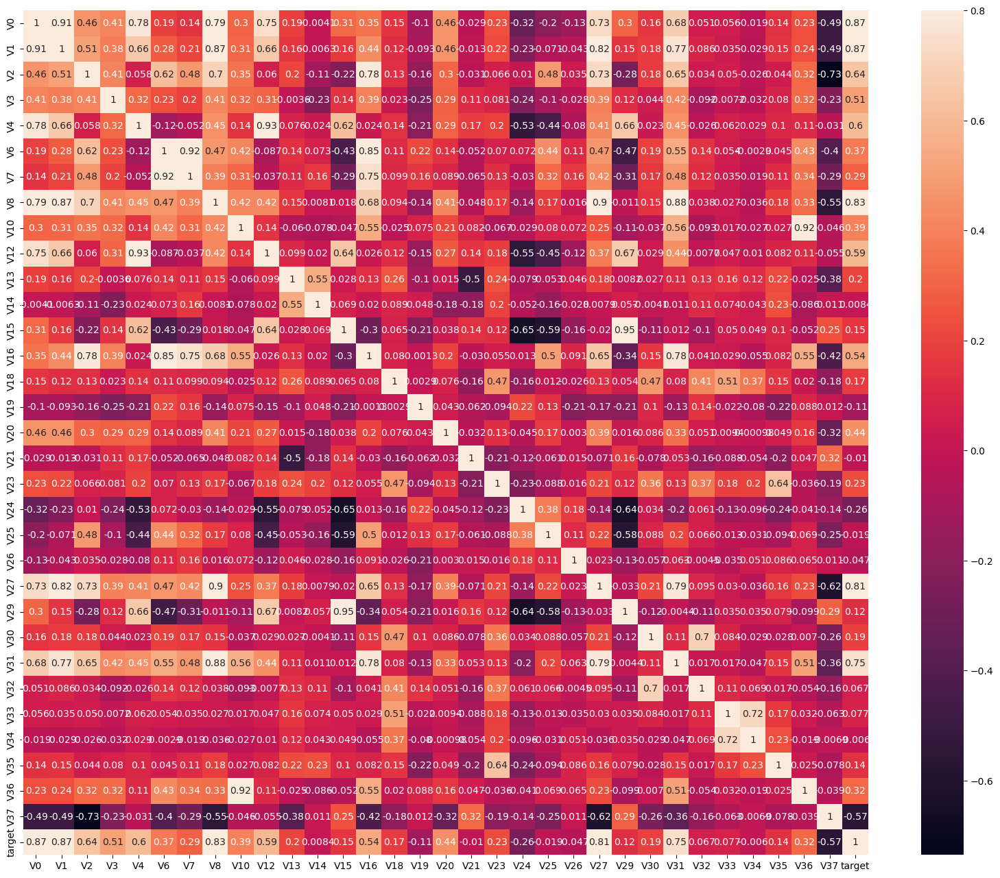
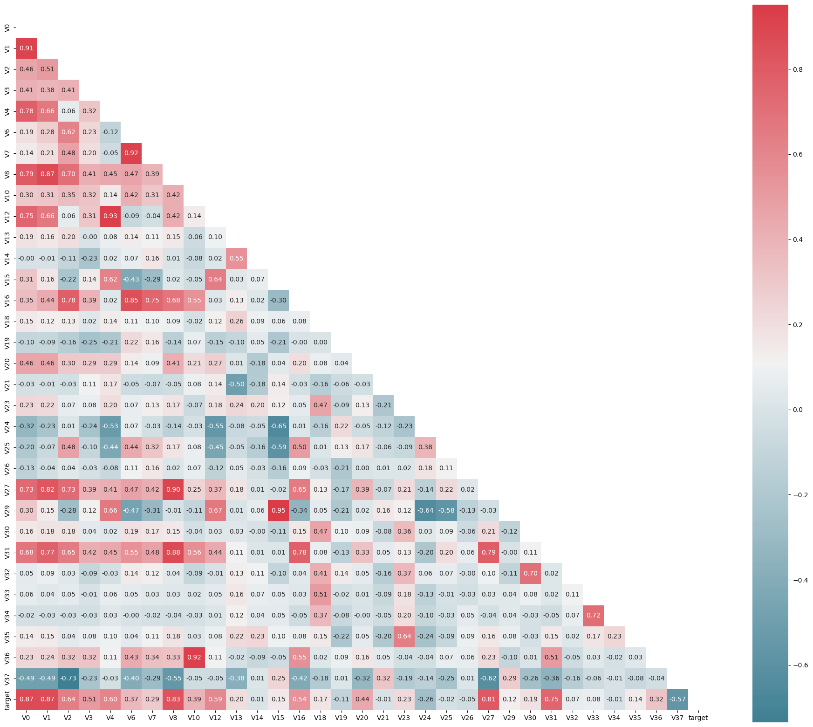

---
# 核心元数据
author: lanshi
date: 2025-04-02T10:00:00+08:00
title: "火力发电效率数据探索分析"

# 内容控制
draft: false
showToc: true
tocOpen: false
showFullContent: false
summary: "本文通过Python数据分析工具对火力发电效率数据进行探索性分析，包括数据可视化、相关性分析和特征筛选。"

# 内容分类
series: "数据分析"
tags: ["Python", "数据分析", "数据可视化", "相关性分析"]
categories: ["数据科学"]

# SEO优化
description: "火力发电效率数据的探索性分析，包括相关性热力图、特征分布可视化和数据预处理"
keywords: ["数据探索", "热力图", "箱线图", "核密度估计", "特征筛选"]

# 主题集成
math: true
comment: true

# 视觉配置
cover:
  image: "cover.png"
  alt: "数据分析可视化封面"
  caption: "数据探索与可视化分析"
  relative: true

# 版权声明
copyright: true
---

## 1. 项目介绍

火力发电的基本原理是：燃料在燃烧时加热水生成蒸汽，蒸汽压力推动汽轮机旋转，然后汽轮机带动发电机旋转，产生电能。在这一系列的能量转化中，影响发电效率的核心是锅炉的燃烧效率，即燃料燃烧加热水产生高温高压蒸汽。

锅炉的燃烧效率的影响因素很多，包括：

- 锅炉的可调参数：如燃烧给量，一二次风，引风，返料风，给水水量
- 锅炉的工况：如锅炉床温、床压，炉膛温度、压力，过热器的温度等

本项目将探索这些因素与发电效率的关系，通过数据分析找出关键影响因素。

## 2. 数据准备与概览

首先导入必要的数据分析库：

```python
import numpy as np
import pandas as pd
import matplotlib.pyplot as plt
import seaborn as sns
from scipy import stats
import warnings
warnings.filterwarnings("ignore")
```

加载训练集和测试集数据：

```python
train_data_file = "./data/zhengqi_train.txt"
test_data_file = "./data/zhengqi_test.txt"

train_data = pd.read_csv(train_data_file, sep='\t')
test_data = pd.read_csv(test_data_file, sep='\t')
```

查看训练数据基本信息：

```python
train_data.info()
test_data.info()
train_data.describe(include='all')
train_data.head()
```

## 3. 数据可视化分析

### 3.1 箱线图分析

箱线图可以帮助我们直观地观察数据分布、识别异常值：



创建所有特征的箱线图：

```python
column = train_data.columns.tolist()[:39]
fig = plt.figure(figsize=(20, 40))
for i in range(39):
    plt.subplot(13, 3, i + 1)
    sns.boxplot(train_data[column[i]], orient="v", width=0.5)
    plt.ylabel(column[i], fontsize=8)
```

### 3.2 特征分布比较

使用核密度估计图比较训练集和测试集的特征分布：



```python
# 绘制所有特征的分布对比
dist_cols = 6
dist_rows = len(test_data.columns)
plt.figure(figsize=(4 * dist_cols, 4 * dist_rows))

i = 1
for col in test_data.columns:
    ax = plt.subplot(dist_rows, dist_cols, i)
    ax = sns.kdeplot(train_data[col], color="Red", shade=True)
    ax = sns.kdeplot(test_data[col], color="Blue", shade=True)
    ax.set_xlabel(col)
    ax.set_ylabel("Frequency")
    ax = ax.legend(["train", "test"])
    i += 1
```

### 3.3 特定特征分析

分析特征'V5', 'V17', 'V28', 'V22', 'V11', 'V9'的分布：

```python
col = 3
row = 2
plt.figure(figsize=(5*col, 5*row))
i = 1
for c in ["V5", "V9", "V11", "V17", "V22", "V28"]:
    ax = plt.subplot(row, col, i)
    ax = sns.kdeplot(train_data[c], color="Red", shade=True)
    ax = sns.kdeplot(test_data[c], color="Blue", shade=True)
    ax.set_xlabel(c)
    ax.set_ylabel("Frequency")
    ax = ax.legend(["train", "test"])
    i += 1
```

## 4. 相关性分析

### 4.1 特征相关性热力图

根据观察到的分布情况，筛选掉部分特征后分析相关性：

```python
drop_col_kde = ["V5", "V9", "V11", "V17", "V22", "V28"]
train_data_drop = train_data.drop(drop_col_kde, axis=1)
train_corr = train_data_drop.corr()
```

绘制相关性热力图：



### 4.2 半热力图

```python
plt.figure(figsize=(24, 20))
mcorr = train_data_drop.corr()
mask = np.zeros_like(mcorr, dtype=np.bool_)
mask[np.triu_indices_from(mask)] = True
cmap = sns.diverging_palette(220, 10, as_cmap=True)
g = sns.heatmap(mcorr, mask=mask, cmap=cmap, square=True, annot=True, fmt="0.2f")
```



## 5. 特征筛选

根据与目标变量的相关性进行特征筛选：

```python
cond = mcorr['target'].abs() < 0.1
drop_col_corr = mcorr.index[cond]
train_data.drop(drop_col_corr, axis=1, inplace=True)
test_data.drop(drop_col_corr, axis=1, inplace=True)
```

## 6. 数据预处理

合并训练集和测试集，添加标签并保存：

```python
train_data["label"] = "train"
test_data["label"] = "test"
all_data = pd.concat([train_data, test_data])
all_data.to_csv('./processed_zhengqi_data.csv', index=False)
```

## 7. 结论

通过探索性数据分析，我们：

1. 识别了训练集和测试集中分布不一致的特征
2. 分析了各特征与目标变量的相关性
3. 筛选出相关性较低的特征并移除
4. 为后续建模做好了数据准备工作

下一步我们将基于这些处理过的数据进行模型构建和评估。
