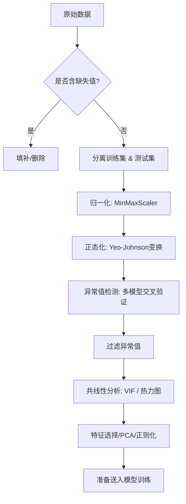

---
# 核心元数据
author: lanshi
date: "2025-09-13T12:47:02+08:00"
lastmod:
title: 火力发电效率数据特征工程

# 内容控制
draft: false
showToc: true
tocOpen: false
showFullContent: true
summary: 本文系统梳理了从数据加载到特征工程核心步骤的技术流程，包括数据归一化、正态化、异常值检测与多重共线性处理。结合技术原理说明、代码解析和可视化分析，适用于数据科学/机器学习初学者或中级用户阅读。

# 内容分类
series:
tags: ["数据预处理", "Python", "Pandas", "Scikit-learn", "Seaborn", "Matplotlib", "归一化", "正态化", "异常值检测", "多重共线性"]
categories: ["数据科学", "机器学习"]

# SEO优化
description: 本文系统梳理了从数据加载到特征工程核心步骤的技术流程，包括数据归一化、正态化、异常值检测与多重共线性处理。结合技术原理说明、代码解析和可视化分析，适用于数据科学/机器学习初学者或中级用户阅读。
keywords: ["数据预处理", "Python", "Pandas", "Scikit-learn", "Seaborn", "Matplotlib", "归一化", "正态化", "异常值检测", "多重共线性", "Box-Cox", "Yeo-Johnson", "VIF", "PCA", "Ridge", "Lasso", "SVR", "XGBoost"]

# 主题集成
math: true
comment: true
hiddenFromSearch: false
hiddenFromHomePage: false

# 视觉配置
cover:
  image: "data-preprocessing-cover.png"
  alt: "数据预处理全流程实战封面"
  caption: "数据预处理全流程实战"
  relative: true

# 版权声明
copyright: true
---

---


> 原文来自 Kaggle 某竞赛数据集（`processed_zhengqi_data.csv`），本笔记系统梳理了从数据加载到特征工程核心步骤的技术流程。
> 技术栈：Python + Pandas + Scikit-learn + Seaborn + Matplotlib
> 适用人群：数据科学家、机器学习工程师、算法学习者

---

## 🔍 一、导入所需库

```python
import numpy as np
import pandas as pd
import matplotlib.pyplot as plt
import seaborn as sns
from scipy import stats
from sklearn import preprocessing
from sklearn.preprocessing import PowerTransformer
from sklearn.model_selection import train_test_split
from sklearn.linear_model import Ridge, Lasso
from sklearn.svm import SVR
from xgboost import XGBRegressor
import warnings
warnings.filterwarnings("ignore")
```

> ✅ **说明**：
> - `seaborn` 和 `matplotlib` 用于可视化；
> - `scipy.stats` 提供统计检验功能（如偏度、Q-Q图）；
> - `PowerTransformer` 实现 Box-Cox / Yeo-Johnson 变换；
> - 所有模型用于异常值检测。

---

## 📥 二、数据加载与初步观察

### 1. 加载数据

```python
all_data = pd.read_csv('./data/processed_zhengqi_data.csv')
display(all_data.head())
```

- 数据包含多个特征列 `V0`, `V1`, ..., `V28`，标签列 `label`（train/test），目标列 `target`。
- 我们将使用 `train` 数据训练模型；`test` 用于预测。

### 2. 分离训练集

```python
cond = all_data['label'] == 'train'
train_data = all_data[cond].copy()
train_data.drop(columns=['label'], inplace=True)
```

> 💡 提示：`copy()` 避免设置副本警告，是良好实践。

---

## 📏 三、数据归一化（Normalization）

归一化目标是将所有特征缩放到 `[0,1]` 区间，避免某些特征因量级过大而主导模型训练。

### 方法一：最小-最大归一化（Min-Max Scaling）

#### 自定义函数实现：

```python
def norm_min_max(col):
    return (col - col.min()) / (col.max() - col.min())
```

#### 使用 `MinMaxScaler` 官方工具：

```python
min_max_scaler = preprocessing.MinMaxScaler()
all_data_normed = min_max_scaler.fit_transform(all_data[columns])
all_data_normed = pd.DataFrame(all_data_normed, columns=columns)
```

✅ **优点**：简单直观，保留原始分布形态。

❌ **注意**：对离群点敏感，若存在极值可能导致压缩过度。

---

## 🌪️ 四、数据正态化（Normalizing Skewed Data）

许多机器学习模型（如线性回归、SVM）假设输入数据服从正态分布。当特征呈偏斜时，需进行变换。

### 4.1 分析 V0 的分布特性

```python
plt.figure(figsize=(12,4))

# 子图1: 直方图 + 正态拟合曲线
sns.histplot(x=train_data['V0'], kde=True, stat="density", ax=plt.subplot(1,3,1))
x = np.linspace(min(train_data['V0']), max(train_data['V0']), 100)
plt.plot(x, stats.norm.pdf(x, *stats.norm.fit(train_data['V0'])), 'r')

# 子图2: Q-Q 图 + 偏度值
stats.probplot(train_data['V0'], plot=plt.subplot(1,3,2))
plt.title(f'skew={stats.skew(train_data["V0"]):.4f}')

# 子图3: 与目标变量相关性散点图
plt.scatter(train_data['V0'], train_data['target'], s=5, alpha=0.5)
plt.title(f'corr={np.corrcoef(train_data["V0"], train_data["target"])[0][1]:.2f}')
```

📌 **观察结果**：
- V0 明显右偏（skew > 0）
- 与 target 关系较弱（corr ≈ 0.09）
- 非正态分布 → 亟需转换

### 4.2 Yeo-Johnson 变换 —— 强力正态化方案

Box-Cox 变换仅适用于正值。**Yeo-Johnson** 是其推广版，支持负值与零。

```python
pt = PowerTransformer(method='yeo-johnson', standardize=True)
all_data[columns] = pt.fit_transform(all_data[columns])
```

> ✅ `standardize=True` 同时做标准化（均值为 0，标准差为 1）
> ✅ 支持任意实数范围

👉 **结论**：Yeo-Johnson 能显著改善数据分布，提升后续建模性能。

🧪 **验证建议**：检查变换前后各特征的 `skewness` 和 `Kurtosis`。

---

## 🧩 五、封装常用数据处理函数

为提高复用性和可维护性，我们封装核心操作函数：

```python
def get_train_data():
    train_data = all_data[all_data["label"] == "train"]
    X = train_data.drop(["target", "label"], axis=1)
    y = train_data["target"]
    return X, y

def split_train_data(test_size=0.2):
    X, y = get_train_data()
    return train_test_split(X, y, test_size=test_size)

def get_test_data():
    test_data = all_data[all_data["label"] == "test"].reset_index(drop=True)
    return test_data.drop(["label", "target"], axis=1)
```

---

## ⚠️ 六、异常值检测（Outlier Detection）

> ❗ 原因：异常样本可能导致模型过拟合或偏差增大。

### 6.1 算法思想：基于残差 Z-score 判别

通过拟合一个回归模型，计算真实值与预测值之间的残差，用标准分数 |Z| > σ 来识别异常点。

### 6.2 实现 `find_outliers` 函数

```python
def find_outliers(model, X, y, sigma=3):
    model.fit(X, y)
    y_pred = pd.Series(model.predict(X), index=y.index)
    resid = y - y_pred
    mean_resid = resid.mean()
    std_resid = resid.std()
  
    Z = (resid - mean_resid) / std_resid
    outliers = Z[abs(Z) > sigma].index

    print(f"R² = {model.score(X, y):.3f}")
    print(f"MSE = {mean_squared_error(y, y_pred):.3f}")
    print("-----------------------------------")
    print(f"Mean residual: {mean_resid:.3f}")
    print(f"Std residual: {std_resid:.3f}")
    print(f"Outliers count: {len(outliers)}")

    # 绘制三联图（真实值 vs 预测值、残差图、残差分布直方图）
    fig, axes = plt.subplots(1, 3, figsize=(15,5))
  
    axes[0].plot(y, y_pred, ".", label="Accepted")
    axes[0].plot(y.loc[outliers], y_pred.loc[outliers], "ro", label="Outlier")
    axes[0].set_xlabel("y"); axes[0].set_ylabel("y_pred")
    axes[0].legend()

    axes[1].plot(y, resid, ".", label="Accepted")
    axes[1].plot(y.loc[outliers], resid.loc[outliers], "ro", label="Outlier")
    axes[1].set_xlabel("y"); axes[1].set_ylabel("Residual")

    Z.plot.hist(bins=50, ax=axes[2], alpha=0.7)
    Z.loc[outliers].plot.hist(color='r', bins=50, ax=axes[2], alpha=0.7)
    axes[2].set_xlabel("Z-score")
    axes[2].legend(['Accepted', 'Outlier'])

    plt.savefig("./export_data/outliers.png")
    return outliers
```

### 6.3 四种模型检测异常值对比

| 模型 | 特点 | 是否适合强非线性 |
|------|------|----------------|
| Ridge | L2 正则化，稳健 | ✅ |
| Lasso | L1 正则化，自动特征选择 | ✅ |
| SVR | 基于核函数，捕捉非线性关系 | ✅✅ |
| XGBoost | 集成树模型，高表达能力 | ✅✅✅ |

#### 运行结果汇总：

```python
outliers1 = find_outliers(Ridge(), X_train, y_train)     # → 83 个
outliers2 = find_outliers(Lasso(), X_train, y_train)     # → 47 个
outliers3 = find_outliers(SVR(), X_train, y_train)       # → 152 个
outliers4 = find_outliers(XGBRegressor(), X_train, y_train)  # → 76 个
```

> ✅ 多模型交叉验证取并集更可靠。

### 6.4 合并异常值并过滤

```python
outliers12 = np.union1d(outliers1, outliers2)
outliers34 = np.union1d(outliers3, outliers4)
outliers_final = np.union1d(outliers12, outliers34)

print("Total outliers removed:", len(outliers_final))
all_data_drop = all_data.drop(labels=outliers_final)
print("New shape:", all_data_drop.shape)
```

📉 最终删除约 **~200** 行记录，减轻了噪声影响。

✔️ 输出图像路径：`./export_data/outliers.png`

---

## 🔗 七、多重共线性分析（Multicollinearity）

> ❌ 问题本质：两个或多个特征高度线性相关 → 设计矩阵奇异 → 线性回归无法求解。

### 7.1 为何要关注？

- 导致权重不稳定（微小变化引发巨大波动）
- 降低模型解释性
- 影响梯度下降收敛速度

### 7.2 常见检测方法

#### ✅ 方法一：相关系数矩阵热力图

```python
corrmatrix = train_data.corr()
plt.figure(figsize=(10,8))
sns.heatmap(corrmatrix, cmap="coolwarm", center=0, square=True)
plt.title("Feature Correlation Map")
plt.show()
```

📌 **关键发现**：
- 若某两列相关系数绝对值 > 0.8，则可能存在共线性；
- 可视化辅助判断哪些特征簇需要合并或剔除。

#### ✅ 方法二：方差膨胀因子（VIF）

```python
from statsmodels.stats.outliers_influence import variance_inflation_factor

vif_data = pd.DataFrame()
vif_data["Feature"] = X.columns
vif_data["VIF"] = [variance_inflation_factor(X.values, i) for i in range(len(X.columns))]

print(vif_data.sort_values(by='VIF', ascending=False))
```

> ✅ `VIF > 5` 或 `10` 即视为存在严重共线性。

### 7.3 解决方案

| 方案 | 适用场景 | 推荐指数 |
|------|----------|---------|
| 删除高度相关特征 | 快速清理冗余 | ⭐⭐⭐⭐ |
| PCA 降维 | 多维复杂关联 | ⭐⭐⭐⭐⭐ |
| Ridge/Lasso 正则化 | 强化鲁棒性 | ⭐⭐⭐⭐⭐ |

🔧 **建议顺序**：
1. 先删冗余项（比如 `V0` 和 `V1` 共线性强）
2. 再用正则化模型应对残余共线性
3. 如需降维→采用 PCA / t-SNE

---

## 📊 总结：完整的数据预处理流程图



---

## 🧠 学习收获总结

| 技能点 | 技术要点 | 应用建议 |
|--------|-----------|------------|
| 数据清洗 | 删除无用列、处理无效标签 | 建议使用 `.copy()` |
| 归一化 | MinMaxScaler 优于手动公式 | 适合神经网络输入 |
| 正态化 | Yeo-Johnson 通用性强 | 替代 Box-Cox |
| 异常值检测 | 多模型融合，提高召回率 | 避免单一模型漏报 |
| 共线性处理 | 利用 VIF 和相关性矩阵 | 早识别早干预 |

---

## 💬 写在最后

> “数据质量决定模型上限。”
> 一次细致的数据预处理，往往比调参更重要。

本篇从理论到代码、从可视化到实际输出，全面展示了如何构建一条**干净、高效、稳健的数据预处理流水线**。无论你是参加竞赛，还是工业项目，这些技巧都值得收藏！

📎 **配套资源建议**：
- 保存生成图像至 `/export_data/`
- 将核心函数放入工具脚本 `preprocess.py`
- 使用版本控制管理数据处理流程

---

📌 **参考文献**
1. Wikipedia: [Support Vector Regression](https://en.wikipedia.org/wiki/Support_vector_regression)
2. Scikit-learn 官方文档：[PowerTransformer](https://scikit-learn.org/stable/modules/generated/sklearn.preprocessing.PowerTransformer.html)
3. ISLR Chapter 6 – Linear Models and Regularization

---

✨ **欢迎点赞 + 收藏 + 转发**，让更多的 AI 学习者看到这份实用教程！


