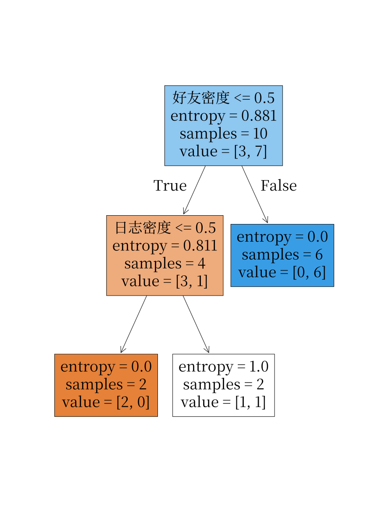
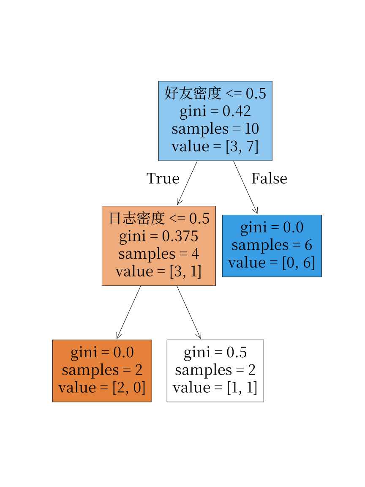
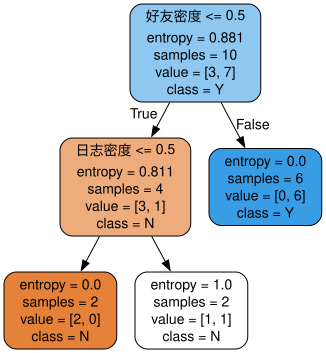

---
# 核心元数据
author: lanshi
date: "2026-05-19T10:30:00+08:00" # 替换为实际发布时间
lastmod: "2026-05-19T22:30:00+08:00" # 后续更新时修改即可
title: "从零理解决策树划分：信息熵与 Gini 系数的手写对照实验"

# 内容控制
draft: false
showToc: true
tocOpen: false
showFullContent: true
summary: "本文基于小规模离散特征分类数据集，先通过sklearn建立决策树基线，再手写实现节点分裂的核心逻辑，对照验证信息熵与基尼系数两种划分准则的行为一致性，从底层理解决策树的生长原理。"

# 内容分类
series:
  - "机器学习原理实践"
tags:
  - "决策树"
  - "信息熵"
  - "Gini系数"
  - "sklearn"
  - "手写算法"
  - "机器学习"
  - "分类算法"
  - "不纯度"
categories:
  - "机器学习"
  - "算法原理"
  - "实战教程"

# SEO优化
description: "本文通过小数据集完成决策树对照实验：先基于sklearn训练信息熵、Gini系数两种准则的决策树作为基线，再手写实现节点分裂的完整搜索逻辑，验证两种划分指标在离散特征上的分裂选择一致性，从底层理解决策树的核心工作机制。"
keywords:
  - "决策树"
  - "信息熵"
  - "基尼系数"
  - "Gini系数"
  - "决策树划分"
  - "sklearn决策树"
  - "手写决策树"
  - "不纯度"
  - "机器学习分类算法"

# 主题集成
math: true # 文章包含数学公式，需开启Katex
comment: true
hiddenFromSearch: false
hiddenFromHomePage: false

# 视觉配置
cover:
  image: "account.svg" # 可替换为决策树相关的专属封面
  alt: "决策树划分：信息熵与Gini系数手写对照实验"
  caption: "手写实现决策树分裂逻辑，对比信息熵与Gini系数的划分效果"
  relative: true

# 版权声明
copyright: true
---
从零理解决策树划分：信息熵与 Gini 系数的手写对照实验

这篇文章记录一次小规模但完整的决策树分类实验：先用 `sklearn` 建立基线，再手写实现“按阈值二分 + 指标最小化”的分裂过程，最后对照信息熵（Entropy）与基尼系数（Gini）两种准则在关键切分点上的一致性与差异。文中同时引用了实验生成的可视化图表以便直观对比（请确保 `data/` 文件夹下的图片文件存在）。

---

## 数据与任务

- **样本数**: 10
- **标签分布**: `Y`: 7，`N`: 3
- **特征**: 日志密度（s/m/l），好友密度（s/m/l），真实头像（N/Y）
- **预处理映射**: `s -> 0`, `m -> 1`, `l -> 2`; `N -> 0`, `Y -> 1`（映射仅为数值化便于按阈值划分）

映射后，按相邻唯一值中点（例如 `0.5`）作为候选阈值进行二分搜索。

---

## sklearn 基线：先确认“答案大致长什么样”

为了有可核对的参考，分别训练两棵树：

- `DecisionTreeClassifier(criterion='entropy')`（信息熵）
- `DecisionTreeClassifier(criterion='gini')`（基尼系数）

并将树可视化导出为 SVG 文件，便于与手写实现的分裂点进行一一对比。

下面的图是实验导出的可视化：

### 图 1：信息熵准则的决策树视图

*图注：使用* *`criterion='entropy'`*  *训练并导出的决策树（SVG）。可见根节点与后续分裂特征与阈值。*

### 图 2：Gini 准则的决策树视图

*图注：使用* *`criterion='gini'`*  *训练并导出的决策树（SVG），对比图 1 可观察到根节点是否相同及分裂阈值差异。*

### 图 3：Graphviz 渲染的另一份输出（可选）

*图注：Graphviz 导出的树形图（若存在）。有时不同导出工具的渲染细节会略有差异，但结构一致时可作为二次核验。*

---

## 手写分裂核心（流程与实现要点）

手写实现的目标并不在于取代高效库，而是深入理解一次分裂如何由不纯度指标驱动。实现流程如下：

1. 对每个特征取唯一值并排序；
2. 用相邻值均值作为候选切分点（例如 `0` 和 `1` 的中点 `0.5`）；
3. 对每个候选点把样本分成左右子集；
4. 计算加权不纯度（基于熵或基尼）；
5. 取最小者作为当前最优切分。

不同之处仅在第 4 步选择的指标：信息熵或基尼系数。

下面给出关键公式以便复现：

### 信息熵（Entropy）

根熵定义为：

$$
H(Y)=-\sum_k p_k \log_2 p_k
$$

切分的不纯度为加权子节点熵：

$$
H_{\text{split}}=\sum_{b\in\{left,right\}} p(b)\,H(Y\mid b)
$$

### 基尼系数（Gini）

基尼定义为：

$$
G(Y)=1-\sum_k p_k^2
$$

加权切分目标：

$$
G_{\text{split}}=\sum_{b} p(b)\,G(Y\mid b)
$$

---

## 实验关键结果（手写实现的数值）

通过对每个特征和候选阈值进行加权不纯度计算，得到如下结果：

- 根节点熵：`H(Y) ≈ 0.881291`。
- 最优根切分（按信息熵）：

  - **特征**：好友密度
  - **阈值**：`0.5`
  - **加权熵**：`≈ 0.3245`
- 最优根切分（按 Gini）：

  - **特征**：好友密度
  - **阈值**：`0.5`
  - **加权 Gini**：`≈ 0.15`

结论：在本数据集上，信息熵与 Gini 在根节点选择上给出了一致的最优切分（均为 `好友密度 < 0.5`）。

### 二层验证（根节点一侧再搜索）

取根节点的左分支（即 `好友密度 < 0.5`）继续搜索最优二层切分，候选特征为 `日志密度` 与 `真实头像`：

- **最优特征**：日志密度
- **阈值**：`0.5`
- **指标值**：熵 `0.5`，Gini `0.25`

因此在二层节点上，两种准则仍然选出相同的分裂位置，说明数据的类别边界在该方向上比较明确。

---

## 实践要点（实用检查清单）

- **候选阈值策略**：使用相邻唯一值中点，避免重复或无意义的阈值。
- **加权方式**：子节点指标须按分支占比加权（`p(b)`），否则不同候选不可直接比较。
- **对照验证**：优先核对“最优特征 + 阈值”，再比对整棵树形。
- **可视化**：SVG/Graphviz 导出有助于快速发现问题（映射错误、标签泄漏、分裂方向异常等）。

---

## 小结与扩展建议

这次实验以小数据集完成了一个从“会调用 API”到“能解释分裂决策”的迁移：

- 用 `sklearn` 建立直观基线并导出可视化；
- 手写实现 Entropy 与 Gini 的加权搜索，验证了关键切分点的一致性；
- 在根节点与二层节点上确认了两种准则的等价选择（在本数据集下）。

后续可以考虑的扩展：

- 在更大数据集上比较两种准则的总体树结构差异与准确率差距；
- 将手写实现封装为函数并添加单元测试，便于教学演示；
- 在博客或报告中嵌入交互式可视化（例如导出为 PNG 或在网页中直接展示 SVG，并添加节点鼠标提示）。
