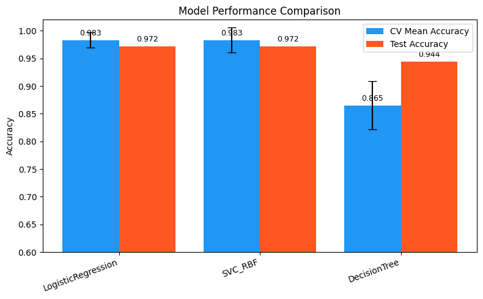
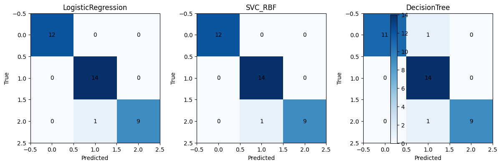

---
# 核心元数据
author: lanshi
date: "2026-05-23T12:18:17+08:00"
lastmod: "2026-05-23T12:18:17+08:00"
title: "葡萄酒数据分类实战：Logistic Regression、SVM 与决策树对比"

# 内容控制
draft: false
showToc: true
tocOpen: false
showFullContent: true
summary: "本文基于scikit-learn自带的公开葡萄酒数据集，完整演示特征标准化、Pipeline串联预处理与模型、5折交叉验证的全流程，对比逻辑回归、RBF核SVM、决策树三类经典分类器的性能差异，给出可复现代码、结果解读与模型选择的实践建议。"

# 内容分类
series:
  - "机器学习实战教程"
tags:
  - "逻辑回归"
  - "SVM"
  - "决策树"
  - "scikit-learn"
  - "分类算法"
  - "交叉验证"
  - "Pipeline"
  - "模型评估"
  - "多分类任务"
categories:
  - "机器学习"
  - "算法对比"
  - "实战教程"

# SEO优化
description: "本文基于sklearn葡萄酒多分类数据集，系统对比逻辑回归、RBF核支持向量机、决策树三类经典分类器的表现，包含标准化预处理要点、Pipeline防数据泄露实现、交叉验证评估方法、可复现代码与结果分析，讲解不同模型的适用场景与常见陷阱。"
keywords:
  - "葡萄酒数据集分类"
  - "逻辑回归SVM决策树对比"
  - "sklearn Pipeline"
  - "交叉验证"
  - "模型评估"
  - "多分类任务"
  - "决策树过拟合"
  - "特征标准化"

# 主题集成
math: false # 本文无LaTeX公式，可关闭减少加载时间
comment: true
hiddenFromSearch: false
hiddenFromHomePage: false

# 视觉配置
cover:
  image: "data/wine.svg" # 可替换为分类器对比相关的专属封面
  alt: "葡萄酒数据分类实战：Logistic Regression、SVM 与决策树对比"
  caption: "基于sklearn公开数据集对比三类经典分类器的性能与适用场景"
  relative: true

# 版权声明
copyright: true
---
# 葡萄酒数据分类实战：Logistic Regression、SVM 与决策树对比


## 摘要

本文使用 scikit-learn 自带的葡萄酒数据集（Wine dataset）演示标准化、模型构建与评估流程，比较三类经典分类器：逻辑回归（Logistic Regression）、支持向量机（SVM，RBF 内核）和决策树（Decision Tree）。目标是说明模型适用场景、预处理要点、评估方法与常见陷阱，并给出可复现的代码示例。

## 数据简介

- 数据来源：`sklearn.datasets.load_wine()`。
- 特征：13 个化学与物理指标（alcohol、malic_acid 等）。
- 目标：3 类葡萄酒类别（多分类问题）。

## 实验流程

1. 加载数据并初步 EDA（特征名、样本数、缺失情况、基本统计）。
2. 特征标准化（使用 `StandardScaler`）。
3. 使用 `Pipeline` 将预处理与模型串联，保证交叉验证与训练/测试过程一致性。
4. 使用交叉验证（例如 5 折 CV）评估模型稳定性，同时用一次训练/测试划分报告最终测试集分数。
5. 比较模型在交叉验证均值、标准差与测试集上的表现，并给出结论。

## 关键点与注意事项

- 标准化：对基于距离或正则化的模型（LR、SVM）非常重要；决策树对缩放不敏感。
- 随机性：使用 `random_state` 固定随机性；多次重复实验或交叉验证可以获得更稳健的结果。
- 模型选择：若数据线性可分，逻辑回归即可；若边界复杂，SVM（RBF）更有优势；若需要解释性与规则，决策树直观但易过拟合。

## 可复现代码（示例）

```python
from sklearn import datasets
from sklearn.model_selection import train_test_split, cross_val_score
from sklearn.preprocessing import StandardScaler
from sklearn.pipeline import Pipeline
from sklearn.linear_model import LogisticRegression
from sklearn.svm import SVC
from sklearn.tree import DecisionTreeClassifier
import numpy as np

# 加载数据
wine = datasets.load_wine()
X = wine.data
y = wine.target

# 划分训练/测试集
X_train, X_test, y_train, y_test = train_test_split(
    X, y, test_size=0.2, random_state=42, stratify=y
)

# 定义模型与 Pipeline
models = {
    'LogisticRegression': Pipeline([
        ('scaler', StandardScaler()),
        ('clf', LogisticRegression(max_iter=5000, random_state=317))
    ]),
    'SVC_RBF': Pipeline([
        ('scaler', StandardScaler()),
        ('clf', SVC(kernel='rbf', random_state=42))
    ]),
    'DecisionTree': Pipeline([
        ('scaler', StandardScaler()),
        ('clf', DecisionTreeClassifier(random_state=42))
    ])
}

# 交叉验证与训练/测试评估
cv_res = {}
res = {}
for name, model in models.items():
    scores = cross_val_score(model, X, y, cv=5, scoring='accuracy')
    cv_res[name] = scores

    model.fit(X_train, y_train)
    train_score = model.score(X_train, y_train)
    test_score = model.score(X_test, y_test)
    res[name] = {'train': train_score, 'test': test_score}

    print(f"{name}: CV mean={scores.mean():.4f}, CV std={scores.std():.4f}")
    print(f"  Train Acc: {train_score:.4f} | Test Acc: {test_score:.4f}\n")
```

## 结果解读

- 交叉验证对比：观察 CV 平均值与标准差可以看出模型的稳健性（CV std 小表示结果稳定）。
- 训练/测试分数：若训练精度远高于测试精度，说明可能存在过拟合（尤其是决策树未经限制时）。
- 综合评估：若 SVM 与 LR 的测试分数接近且稳定，且决策树训练高但测试低，表明树模型在该配置下更容易过拟合。

## 实验结果

以下结果由本仓库脚本 `scripts/generate_wine_results.py` 生成，并保存在 `data/wine_results.json`。对比图与混淆矩阵已保存为 `data/model_comparison.png` 与 `data/confusion_matrices.png`。

- 交叉验证（5 折）结果：
    - LogisticRegression: mean=0.9832, std=0.0137
    - SVC_RBF: mean=0.9833, std=0.0222
    - DecisionTree: mean=0.8654, std=0.0440

- 训练/测试分数（一次固定划分，test_size=0.2, random_state=42）：
    - LogisticRegression: Train=1.0000, Test=0.9722
    - SVC_RBF: Train=0.9930, Test=0.9722
    - DecisionTree: Train=1.0000, Test=0.9444

- 分类指标（测试集，weighted avg F1）：
    - LogisticRegression: F1 (weighted) = 0.9720
    - SVC_RBF: F1 (weighted) = 0.9720
    - DecisionTree: F1 (weighted) = 0.9450

下面展示模型对比图与混淆矩阵：





简要分析：

- Logistic Regression 与 SVM 在本数据集上表现几乎相同（测试集准确率均约 97.22%），交叉验证均值也非常接近且波动小，说明两者在该任务上都较稳健。
- 决策树在训练集上达到 100%（未限制深度），但交叉验证均值与测试集表现略低（测试约 94.44%），提示存在一定程度的过拟合；通过限制 `max_depth` 或使用集成方法可改善泛化能力。
- 从混淆矩阵看，主要错误集中在某一类别的少量混淆（如类别 2 被误判为 1），这提示可以针对该类别做更多的特征工程或采样策略。

## 可扩展方向

- 使用网格搜索或贝叶斯优化调参（`GridSearchCV` / `RandomizedSearchCV` / `Optuna`）。
- 尝试集成方法（RandomForest、Gradient Boosting）提升泛化能力。
- 使用混淆矩阵、分类报告（precision/recall/F1）以及 ROC/PR 曲线做更全面评估。
- 对特征进行重要性分析（决策树或基于树的模型），辅助领域专家解释。

## 结论

- 对基于距离或正则化的模型务必标准化；决策树不依赖缩放但容易过拟合。
- 交叉验证是评估模型稳健性的关键手段；多次重复实验能降低因随机划分引入的波动。
- 实际使用中建议在模型选择之外注重调参与验证流程，以及使用集成模型作为基线。

## 运行提示

在包含本代码的项目环境中，建议先安装依赖：

```bash
pip install -r requirements.txt
# 或者至少：
pip install scikit-learn pandas matplotlib
```

将本示例与 notebook 联合运行，能够更直观地查看分布图与比较图表。


