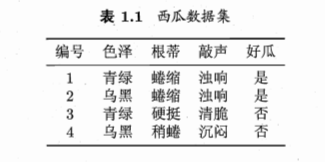

---
# 核心元数据
author: lanshi
date: "2025-03-20T18:30:00+08:00"
lastmod:
title: "西瓜书学习笔记(一)--绪论"

# 内容控制
draft: false
showToc: true
tocOpen: false
showFullContent: true
summary: 本文将介绍机器学习的基本概念包括样本、示例、训练集、测试集等,并讨论机器学习的发展历程和现状,同时引用了“没有免费午餐”定理来讨论归纳偏好问题。

# 内容分类
series:
tags: ["机器学习"]
categories: ["机器学习", "AI学习"]

# SEO优化
description: "机器学习的基本概念包括样本、示例、训练集、测试集等，对于机器学习的发展历程和现状进行分析，并引用了“没有免费午餐”定理来讨论归纳偏好问题。"
keywords: ["机器学习", "样本", "示例", "训练集", "测试集", "没有免费午餐定理", "归纳偏好"]

# 主题集成
math: true
comment: true
hiddenFromSearch: false
hiddenFromHomePage: false

# 视觉配置
cover:
  image: "database-cover.png"
  alt: "机器学习的基本概念与发展历程"
  caption: "机器学习的基本概念与发展历程"
  relative: true

# 版权声明
copyright: true
---

# 绪论

## 引言

(略)

## 基本术语

1.  样本/示例 - sample/instance
2.  训练集 - training data
3.  测试集 - testing data
4.  标记 - label
5.  样例 - example: 拥有label的instance
6.  泛化 - generalization

## 假设空间

### 科学推理

-   归纳 (induction) - 从具体的事实归结出一般性规律
-   演绎 (deduction) - 从基础原理推演出具体状况

### 归纳学习 (inductive learning)

-   广义归纳学习
-   狭义归纳学习 (概念学习)
    -   eg: 布尔概念学习

### 版本空间 (version space)

即存在着一个与训练集一致的"假设集合"

## 归纳偏好

有多个与训练集一致的假设, 但测试新样本时有不同的输出结果, 那么采用哪种模型(假设)?

### "奥卡姆剃刀"原则

若有多个假设与观察一致, 则选最简单的那个.
利用什么原则, 取决于算法能否获得更好的性能, 泛化能力是否更强

### NFL(No Free Lunch Theorem)定理--"没有免费的午餐"定理

> **Theorem 1 (No Free Lunch 定理)**
> 对于所有学习算法 $\mathcal{L}_a$ 和 $\mathcal{L}_b$，在均匀分布的目标函数空间下，它们的训练外误差满足：
> $$
> \sum_f E_{ote}(\mathcal{L}_a|X,f) = \sum_f E_{ote}(\mathcal{L}_b|X,f)
> $$

**Proof:**

**Step 1: 定义与假设**
假设样本空间 $\mathcal{X}$ 和假设空间 $\mathcal{H}$ 是离散的。定义：
$$
E_{ote}(\mathcal{L}_a|X,f) = \sum_{h \in \mathcal{H}} \sum_{x \in \mathcal{X} - X} P(x) \cdot \mathbb{I}(h(x) \neq f(x)) \cdot P(h|X,\mathcal{L}_a)
$$
其中 $\mathbb{I}(\cdot)$ 为指示函数。

**Step 2: 总误差求和**
对所有目标函数求和：
$$
\sum_f E_{ote}(\mathcal{L}_a|X,f) = \sum_f \sum_h \sum_{x \in \mathcal{X}- X} P(x)\mathbb{I}(h(x)\neq f(x))P(h|X,\mathcal{L}_a)
$$

**Step 3: 交换求和顺序**
将 $\sum_f$ 移至内部：
$$
\begin{aligned}
&= \sum_{x \in \mathcal{X}- X} P(x) \sum_h P(h|X,\mathcal{L}_a) \\
&\quad \times \underbrace{\sum_f \mathbb{I}(h(x)\neq f(x))}_{\mathbf{关键项}}
\end{aligned}
$$

**Step 4: 计算关键项**
对于二分类问题，每个 $x$ 处的 $f(x)$ 有等概率取 0 或 1：
$$
\sum_f \mathbb{I}(h(x)\neq f(x)) = \frac{1}{2} \cdot 2^{|\mathcal{X}|} = 2^{|\mathcal{X}|-1}
$$

**Step 5: 最终化简**
代入关键项并利用 $\sum_h P(h|X,\mathcal{L}_a) = 1$：
$$
\text{原式} = 2^{|\mathcal{X}|-1} \sum_{x \in \mathcal{X}- X} P(x)
$$
该结果与算法 $\mathcal{L}_a$ 无关，故对任意 $\mathcal{L}_a, \mathcal{L}_b$：
$$
\sum_f E_{ote}(\mathcal{L}_a|X,f) = \sum_f E_{ote}(\mathcal{L}_b|X,f)
$$

由 Theorem 1 可知, 脱离具体问题, 空谈"什么学习算法最好"是毫无意义的

## 发展历程

-   推理期: 1950s-1970s -- 符号知识, 演绎推理
-   知识期: 1970s中期 -- 符号知识, 领域知识
-   学习期: 1980s -- 机器学习, 归纳逻辑程序设计(Inductive Logic Programming)
-   统计学习: 1990s中期 -- 向量机(Support Vector Machine), 核方法(Kernel Methods)
-   深度学习: 2000s -- 神经网络

## 应用现状

信息科学, 自然科学…

## 阅读材料

### 机器学习

-   国际会议: ICML, NIPS，COLT, ECML(Europe), ACML(Asia)
-   国际期刊: JMLR, ML
-   国内会议: CCML, MLA

### 人工智能

-   国际会议: IJCAI, AAAI
-   国际期刊: AI, JAIR

### 数据挖掘

-   国际会议: KDD, ICDM
-   国际期刊: ACM-TKDD, DMKD

### 计算机视觉

-   CVPR(会议), IEEE-TPAMI(期刊)

### 神经网络

-   期刊: NC, IEEE-TNNLS

### 统计学

-   期刊: AS

## 习题

### 1. 表1.1中若只包含编号为1和4的两个样例，试给出相应的版本空间.

图1: 表1.1西瓜数据集

**解:**

表1: 版本空间表

| 色泽   | 根蒂   | 敲声   | 逻辑表达式                                                                 |
| :----- | :----- | :----- | :------------------------------------------------------------------------- |
| 青绿   | 瓣缩   | 浊响   | $(\text{色泽} = \text{青绿}) \land (\text{根蒂} = \text{瓣缩}) \land (\text{敲声} = \text{浊响})$ |
| 青绿   | 瓣缩   | *      | $(\text{色泽} = \text{青绿}) \land (\text{根蒂} = \text{瓣缩})$                   |
| 青绿   | *      | 浊响   | $(\text{色泽} = \text{青绿}) \land (\text{敲声} = \text{浊响})$                   |
| *      | 瓣缩   | 浊响   | $(\text{根蒂} = \text{瓣缩}) \land (\text{敲声} = \text{浊响})$                   |
| 青绿   | *      | *      | $(\text{色泽} = \text{青绿})$                                               |

### 2. 估算共有多少种可能的假设

与使用单个合取式来进行假设表示相比，使用“析合范式”将使得假设空间具有更强的表示能力。例如

好瓜 $\Leftrightarrow ((\text{色泽} = \star) \land (\text{根蒂} = \text{蜷缩}) \land (\text{敲声} = \star)) \lor ((\text{色泽} = \text{乌黑}) \land (\text{根蒂} = \star) \land (\text{敲声} = \text{沉闷}))$，

会把 “(色泽 = 青绿) ∧ (根蒂 = 蜷缩) ∧ (敲声 = 清脆)” 以及 “(色泽 = 乌黑) ∧ (根蒂 = 硬挺) ∧ (敲声 = 沉闷)” 都分类为 “好瓜”。
若使用最多包含 k 个合取式的析合范式来表达表 1.1 西瓜分类问题的假设空间，试估算共有多少种可能的假设。

**解:**
色泽包含两种情况(青绿, 乌黑), 三种选择(青绿, 乌黑, *);
根蒂(蜷缩, 稍蜷, 硬挺)共4种选择;
敲声(浊响/沉闷/清脆)共4种选择;

除了不能存在(*,*,*)的组合, 共包含 $3 \times 4 \times 4 - 1 = 47$ 种组合。
题目求k个合取式的所有可能的组合之和, 则有
$$
\sum_{i=1}^{k} \binom{47}{i}
$$

### 3. 若数据包含噪声，则假设空间中有可能不存在与所有训练样本都一致的假设。在此情形下，试设计一种归纳偏好用于假设选择。

**解:**
刚入门, 可能无法正确回答此问题, 但存在的方法应该有:
选择与尽可能多的训练样本一致的假设，或者选择在衡量鲁棒性或复杂度后最优的假设。例如，可以选择 "多数投票" 的假设，或者引入正则化项来惩罚模型复杂度， favoring simpler models even if they misclassify some noisy data points. 也可以是选择能够最小化某种形式的经验风险（考虑噪声）的假设。

### 4. 试证明“没有免费的午餐定理”仍成立。

本章 1.4 节在论述“没有免费的午餐”定理时，默认使用了“分类错误率”作为性能度量来对分类器进行评估。若换用其他性能度量 $\ell$，则式(1.1)将改为

$$ E_{ote}(\mathcal{L}_a | X, f) = \sum_h \sum_{x \in \mathcal{X} - X} P(x) \ell(h(x), f(x)) P(h | X, \mathcal{L}_a) $$

试证明“没有免费的午餐定理”仍成立。

**证明:**

**Step 1:**
性能度量虽发生了改变, 目标函数仍然均匀分布, 总误差表达式为:
$$
\begin{aligned}
\sum_f E_{ote}(\mathcal{L}_a | X, f) &= \sum_f \sum_h \sum_{x \in \mathcal{X} - X} P(x) \ell(h(x), f(x)) P(h | X, \mathcal{L}_a) \\
&= \sum_{x \in \mathcal{X}-X} P(x) \sum_h P(h | X, \mathcal{L}_a) \sum_f \ell(h(x), f(x))
\end{aligned}
$$

**Step 2:**
由 Theorem 1 的证明过程（特别是计算关键项的逻辑）可知，对于固定的 $x$ 和 $h(x)$，在所有可能的函数 $f$ 上求和时，有一半的函数满足 $f(x) = 0$，另一半满足 $f(x) = 1$。总共有 $2^{|\mathcal{X}|}$ 个可能的函数。
因此:
$$
\sum_f \ell(h(x), f(x)) = \sum_{f: f(x)=0} \ell(h(x), 0) + \sum_{f: f(x)=1} \ell(h(x), 1)
$$
$$
= 2^{|\mathcal{X}|-1} \ell(h(x), 0) + 2^{|\mathcal{X}|-1} \ell(h(x), 1)
$$
$$
\therefore \sum_f \ell(h(x), f(x)) = 2^{|\mathcal{X}|-1} \left[ \ell(h(x), 0) + \ell(h(x), 1) \right].
$$

**Step 3:**
代入 Step 1 的结果:
$$
\sum_f E_{ote}(\mathcal{L}_a | X, f) = \sum_{x \in \mathcal{X}-X} P(x) \sum_h P(h | X, \mathcal{L}_a) \left( 2^{|\mathcal{X}|-1} \left[ \ell(h(x), 0) + \ell(h(x), 1) \right] \right)
$$
$$
= 2^{|\mathcal{X}|-1} \sum_{x \in \mathcal{X}-X} P(x) \sum_h P(h | X, \mathcal{L}_a) \left[ \ell(h(x), 0) + \ell(h(x), 1) \right]
$$
*(注：原文中提供的这一步似乎试图展示内部求和项的独立性，但其逻辑可能基于特定假设或不易理解。如果假设损失函数是对称的，即 $\ell(0, 1) = \ell(1, 0) = c$ 且 $\ell(0, 0) = \ell(1, 1) = 0$，则 $\ell(h(x), 0) + \ell(h(x), 1) = c$ 恒成立，此时 $\sum_h P(h | X, \mathcal{L}_a) \cdot c = c$，该项与 $\mathcal{L}_a$ 无关。)*

如果 $\sum_h P(h | X, \mathcal{L}_a) \left[ \ell(h(x), 0) + \ell(h(x), 1) \right]$  确实与算法 $\mathcal{L}_a$ 无关（例如在对称损失假设下），或者其平均值（通过 P(x) 加权并在 $\mathcal{X}-X$ 上求和）与算法无关，则定理成立。
设 $C = \sum_{x \in \mathcal{X}-X} P(x) \sum_h P(h | X, \mathcal{L}_a) \left[ \ell(h(x), 0) + \ell(h(x), 1) \right]$。如果 $C$ 对于所有 $\mathcal{L}_a, \mathcal{L}_b$ 都相同，则：
$$
\sum_f E_{\text{ote}}(\mathcal{L}_a | X, f) = 2^{|\mathcal{X}|-1} \cdot C
$$
此结果与具体算法无关。

结论：无论选择何种性能度量 $\ell$，只要真实目标函数 $f$ 在所有可能的函数上均匀分布，并且（通常隐式要求的）损失函数具有某种对称性或其在算法假设分布下的期望值不依赖于特定算法时，无免费午餐定理仍然成立。算法的平均性能与算法本身的设计无关。

### 5. 试述机器学习能在互联网搜索的哪些环节起什么作用。

**解:**
机器学习贯穿搜索的全流程，从理解用户意图到动态优化搜索结果，其核心价值在于通过数据驱动的方式提升搜索效率、准确性和个性化程度。
主要环节和作用包括：
1.  **查询理解 (Query Understanding):**
    *   **意图识别:** 使用分类模型（如 SVM, 神经网络）判断用户查询的意图（信息性、导航性、交易性等）。
    *   **查询扩展/改写:** 利用词向量(Word2Vec, GloVe)、主题模型(LDA)或序列到序列模型(Seq2Seq)来丰富查询词，召回更相关的结果。
    *   **实体识别/链接:** 识别查询中的命名实体（人名、地名、产品名等）并链接到知识库，以提供更精确的答案或相关信息。
2.  **内容分析与索引 (Content Analysis & Indexing):**
    *   **文档分类/聚类:** 使用 TF-IDF、文本分类模型（如 Naive Bayes, CNN, RNN）对网页进行主题分类，或使用聚类算法（如 K-Means）发现文档集合的结构。
    *   **重要性/质量评估:** 利用 PageRank 类算法的变种或基于内容的特征（如文本质量、链接结构）训练模型来评估网页质量。
    *   **特征提取:** 提取文本、图像、视频等多模态内容的特征表示，用于后续的匹配和排序。
3.  **检索匹配 (Retrieval & Matching):**
    *   **向量化召回:** 使用双塔模型、DSSM、BERT 等深度学习模型将查询和文档映射到同一向量空间，通过向量相似度（如余弦相似度）快速召回候选文档。
    *   **语义匹配:** 超越关键词匹配，理解查询和文档之间的深层语义关联。
4.  **结果排序 (Ranking):**
    *   **Learning to Rank (LTR):** 这是机器学习在搜索中最核心的应用之一。使用点对(Pointwise)、配对(Pairwise)或列表(Listwise)方法（如 RankNet, LambdaMART, GBDT）训练模型，融合数百上千种特征（查询相关性、页面质量、用户行为、个性化特征等）来优化搜索结果的排列顺序，提升用户满意度。
5.  **个性化 (Personalization):**
    *   **用户画像:** 基于用户的历史搜索记录、点击行为、地理位置等信息，构建用户画像。
    *   **个性化排序/推荐:** 利用协同过滤、内容推荐或混合模型，根据用户画像调整搜索结果排序或推荐相关内容。
6.  **用户交互与反馈 (User Interaction & Feedback):**
    *   **点击模型:** 分析用户点击日志（Click Log），构建点击模型（如 CTR 预估模型）来反哺排序模型，理解用户偏好。
    *   **A/B 测试与在线学习:** 利用 A/B 测试平台评估新算法效果，并采用在线学习方法（如 Bandit 算法）动态调整策略。
7.  **反作弊 (Anti-Spam):**
    *   使用分类模型识别搜索结果中的垃圾网页（Search Spam），保证搜索结果质量。

总之，机器学习通过学习数据中的模式，使得搜索引擎能够更智能地理解用户需求、评估网页内容、匹配查询与文档、优化结果排序，并提供个性化、高质量的搜索体验。
