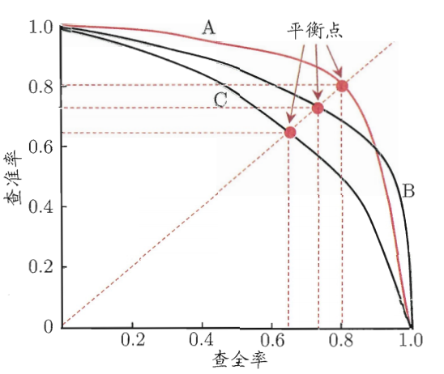
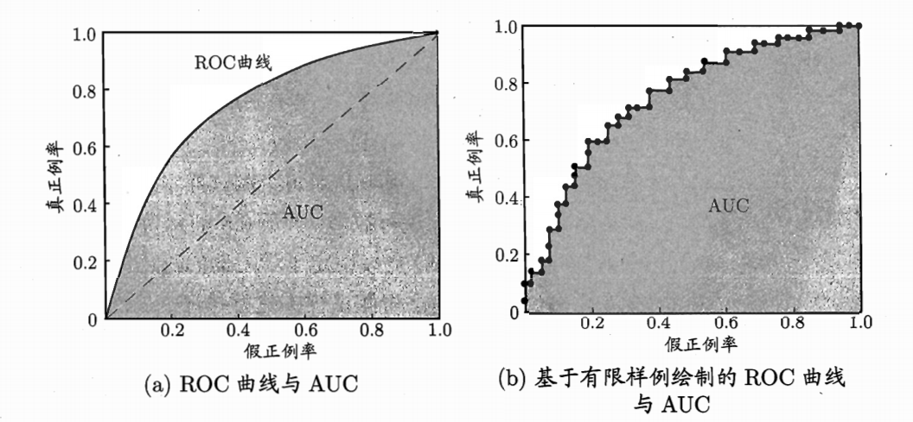
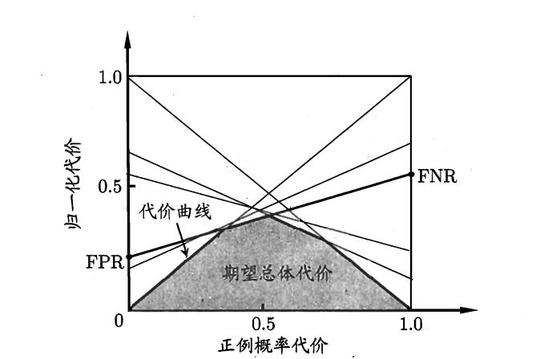
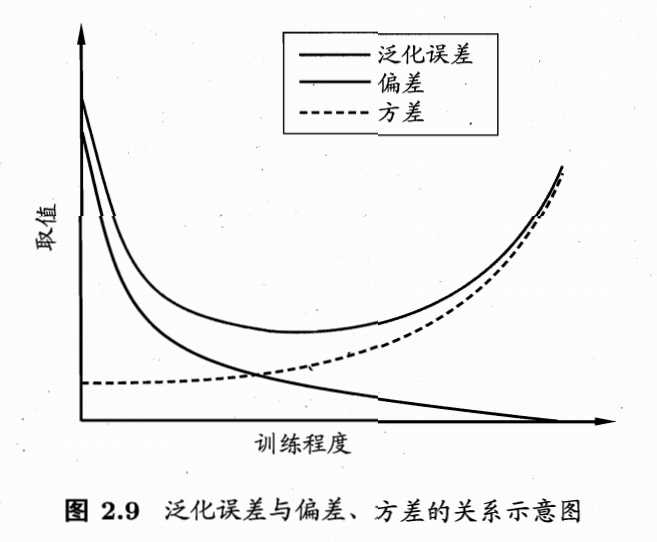

---
# 核心元数据
author: lanshi
date: "2025-06-15T18:00:00+08:00"
lastmod:
title: "模型评估与选择"

# 内容控制
draft: false
showToc: true
tocOpen: false
showFullContent: true
summary: "本文详细介绍了模型评估与选择的相关概念，包括经验误差与拟合、评估方法、性能度量等内容。"

# 内容分类
series:
tags: ["机器学习", "模型评估", "模型选择"]
categories: ["机器学习"]

# SEO优化
description: "本文深入探讨了模型评估与选择的核心概念，包括经验误差与拟合、评估方法、性能度量等，帮助读者更好地理解和应用这些知识。"
keywords: ["模型评估", "模型选择", "经验误差", "拟合", "评估方法", "性能度量"]

# 主题集成
math: true
comment: true
hiddenFromSearch: false
hiddenFromHomePage: false

# 视觉配置
cover:
  image: "模型评估与选择_cover.png"
  alt: "模型评估与选择封面"
  caption: "模型评估与选择"
  relative: true

# 版权声明
copyright: true
---
# 模型评估与选择

## 经验误差与拟合

- 错误率：m个样本中有a个样本分类错误，则错误率\(E = a/m\).
- 精度：\(1 - a/m\)
- 误差：学习器的实际预测输出与样本的真实输出之间的差异；训练集上的叫**训练误差**/**经验误差**，新样本上的叫**泛化误差**；
- 过拟合（更容易遇到的情况）：将个例的特殊性错误地视为样本的普遍性；欠拟合：没有学好.
- 模型选择：在多种学习算法中，选择合适的算法中的合适的参数配置.

## 评估方法

### 留出法

直接将数据集D划分为两个互斥的集合，其中一个集合作为训练集S，另一个作为测试集T。在S上训练出模型后用T来评估其测试误差.

### 交叉验证法

将数据集分为k个相似的子集，每一折交叉验证时，k-1为训练集，剩余的一个为测试集，共k次不同的测试集，为k折交叉验证法.

#### 留一法(LOO)

数据集共m个，当k=m时，为留一法。训练出来的模型会更准确，但计算开销较大.

### 自助法(Bootstrapping)

有放回的重复随机抽样，执行m次得到m个样本的数据集\(D'\).

| 方法              | 数据划分方式         | 数据利用率 | 计算成本 | 适用场景            |
|-------------------|--------------------|-----------|----------|---------------------|
| 留出法            | 单次划分训练集/测试集 | 低        | 低       | 大数据快速验证      |
| 交叉验证          | 多次划分（\(k\)个子集轮流验证） | 高       | 中       | 中等数据模型调优    |
| 留一法            | 每次留1个样本验证   | 最高      | 高       | 小样本高精度评估    |
| 自助法            | 有放回重采样生成多样本集 | 灵活     | 中       | 小样本统计推断、不确定性估计 |

### 选择建议

- 数据量大且需快速验证：留出法。
- 中等数据调参：\(k\)-折交叉验证（如5折或10折）。
- 小样本高精度需求：留一法（但需权衡计算成本）。
- 统计量分布估计或小样本：自助法。

### 调参与最终模型

调参对最终模型有关键性影响，通过验证集来评估模型的好坏。

## 性能度量

使用不同的性能度量会导致不同的评判结果。

### 回归任务

比如，回归任务最常用的性能度量是“均方误差”：
\[
E(f;D) = \frac{1}{m} \sum_{i=1}^{m} (f(x_i) - y_i)^2
\]
更一般的，对于数据分布D和概率密度函数\(p(\cdot)\)，均方误差可表示为：
\[
E(f;D) = \int_{x \sim D} (f(x) - y)^2 p(x) dx
\]

### 错误率与精度

对于样例集D，分类错误率定义为：
\[
E(f;D) = \frac{1}{m} \sum_{i=1}^{m} \mathbb{I}(f(x_i) \neq y_i)
\]

精度定义为：
\[
\text{acc}(f;D) = 1 - E(f;D) = \frac{1}{m} \sum_{i=1}^{m} \mathbb{I}(f(x_i) = y_i)
\]

更一般的，对于数据分布D和概率密度函数\(p(\cdot)\)，错误率可表示为：
\[
E(f;D) = \int_{x \sim D} \mathbb{I}(f(x) \neq y) p(x) dx
\]

精度可表示为：
\[
\text{acc}(f;D) = 1 - E(f;D) = \int_{x \sim D} \mathbb{I}(f(x) = y) p(x) dx
\]

### 查准率、查全率与F1值

查准率（Precision）和查全率（Recall）是分类任务中常用的性能度量，尤其在处理不平衡数据集时非常重要。

#### 查准率（Precision）

查准率亦称准确率，表示预测为正例的样本中实际为正例的比例：
\[
\text{Precision} = \frac{\text{TP}}{\text{TP} + \text{FP}}
\]
其中，TP表示真正例（True Positives），即被正确预测为正例的样本数；FP表示假正例（False Positives），即被错误预测为正例的样本数。

#### 查全率（Recall）

查全率亦称召回率，表示实际为正例的样本中被正确预测为正例的比例：
\[
\text{Recall} = \frac{\text{TP}}{\text{TP} + \text{FN}}
\]
其中，TP表示真正例，FN表示假负例（False Negatives），即被错误预测为负例的正例样本数。

#### 查准率和查全率的权衡

查准率和查全率之间通常存在权衡关系：提高查准率可能会降低查全率，反之亦然。P-R曲线（Precision-Recall Curve）可以帮助可视化这种权衡关系。
如图\ref{fig:pr_curve}所示，P-R曲线展示了不同阈值下查准率和查全率的变化情况。

虽然BEP是查准率=查全率时的点，但在实际应用中，查准率和查全率通常不会相等，因此需要综合考虑两者的平衡。

#### F1值

F1值是查准率和查全率的调和平均数，常用来综合评估分类器的性能：
\[
F1 = \frac{2 \times P \times R}{P + R}
\]
但在实际应用中，查准率和查全率的权衡关系通常需要根据具体任务和数据集来调整。所以F1的一般形式--- \(F_\beta\)，加权调和平均数能够根据任务需求调整查准率和查全率的权重：
\[
F_\beta = \frac{(1+\beta^2) \times P \times R}{\beta^2 \times P + R}
\]

#### 宏平均和微平均

对于有多个二分类混淆矩阵的多分类任务，可以使用宏平均（Macro-Averaging）和微平均（Micro-Averaging）来计算整体的查准率、查全率和F1值。

##### 宏平均

宏平均是对每个类别单独计算查准率和查全率，然后取平均值：
\[
P_{macro} = \frac{1}{n} \sum_{i=1}^{n} P_i
\]
\[
R_{macro} = \frac{1}{n} \sum_{i=1}^{n} R_i
\]
\[
F1_{macro} = \frac{2 \times P_{macro} \times R_{macro}}{P_{macro} + R_{macro}}
\]

##### 微平均

微平均则是将所有类别的TP、FP和FN加总后计算查准率和查全率：
\[
P_{micro} = \frac{\sum_{i=1}^{n} TP_i}{\sum_{i=1}^{n} TP_i + \sum_{i=1}^{n} FP_i}
\]
\[
R_{micro} = \frac{\sum_{i=1}^{n} TP_i}{\sum_{i=1}^{n} TP_i + \sum_{i=1}^{n} FN_i}
\]
\[
F1_{micro} = \frac{2 \times P_{micro} \times R_{micro}}{P_{micro} + R_{micro}}
\]

## ROC曲线与AUC

ROC曲线（Receiver Operating Characteristic Curve）是评估二分类模型性能的常用工具，通过绘制真正率（TPR）与假正率（FPR）的关系来展示分类器在不同阈值下的表现。

#### 真正率（TPR）

真正率（TPR）也称为查全率（Recall），表示实际正例中被正确预测为正例的比例：
\[
\text{TPR} = \frac{\text{TP}}{\text{TP} + \text{FN}}
\]

#### 假正率（FPR）

假正率（FPR）表示实际负例中被错误预测为正例的比例：
\[
\text{FPR} = \frac{\text{FP}}{\text{FP} + \text{TN}}
\]

ROC曲线通过改变分类阈值，计算不同阈值下的TPR和FPR，从而绘制出一条曲线。理想情况下，ROC曲线应尽可能接近左上角（TPR=1, FPR=0），表示模型能够正确识别所有正例且不误判负例。

#### AUC

AUC（Area Under the Curve）是ROC曲线下的面积，表示模型的整体性能。AUC值介于0和1之间，值越大表示模型性能越好。AUC=0.5表示模型没有区分能力，相当于随机猜测；AUC=1表示完美分类器。

图\ref{fig:roc_curve}展示了ROC曲线的示例。

AUC可以通过计算ROC曲线下的积分来获得，常用的计算方法包括梯形法则和蒙特卡洛积分等。估算公式为：
\[
AUC = \frac{1}{2} \sum_{i=1}^{n-1} (FPR_{i+1} - FPR_i)(TPR_{i+1} + TPR_i)
\]

形式上看，AUC考虑的是样本预测的排序质量，因此它与排序误差紧密相连。给定\(m^+\)个正例和\(m^-\)个反例，令\(D^+\)和\(D^-\)分别为正例和反例的样本集，则损失可以表示为：
\[
\ell_{rank} = \frac{1}{m^+ m^-} \sum_{x^+ \in D^+} \sum_{x^- \in D^-}\big( \mathbb{I}(f(x^+) < f(x^-)) + \frac{1}{2}\mathbb{I}(f(x^+) = f(x^-))\big)
\]

容易看出，\(\ell_{rank}\)对应的是ROC曲线上的面积，故AUC可以表示为：
\[
AUC = 1 - \ell_{rank}
\]

## 代价敏感错误率与代价曲线

非均等代价：在某些应用中，不同类型的错误可能具有不同的代价，例如在医疗诊断中，漏诊（假阴性）可能比误诊（假阳性）更严重。

#### 代价敏感错误率

在这种情况下，需要引入代价敏感错误率来衡量模型的性能，定义为：
\[
E_{f;D;cost} = \frac{1}{m} \big(\sum_{x_i \in D^+} \mathbb{I}(f(x_i) \neq y_i) \cdot cost_{FP} + \sum_{x_i \in D^-} \mathbb{I}(f(x_i) \neq y_i) \cdot cost_{FN}\big)
\]
其中，\(cost_{FP}\)和\(cost_{FN}\)分别表示假正例和假负例的代价。

#### 代价曲线

代价曲线是代价敏感错误率随分类阈值变化的图形表示，可以帮助选择最优的分类阈值以最小化总代价。

其中，横轴是取值为[0,1]的正例概率代价：
\[
P(+)cost = \frac{p \cdot cost_{FP}}{p \cdot cost_{FP} + (1-p) \cdot cost_{FN}}
\]
其中，p为正例的概率，纵轴是取值为[0,1]的归一化代价：
\[
cost_{norm} = \frac{FNR \cdot p \cdot cost_{FP} + FPR \cdot (1-p) \cdot cost_{FN}}{p \cdot cost_{FP} + (1-p) \cdot cost_{FN}}
\]

图\ref{fig:cost_curve}展示了代价曲线的示例。

## 比较检验

### 假设检验

假设检验是一种统计方法，用于判断样本数据是否支持某个假设。常见的假设检验包括t检验、卡方检验等。在模型评估中，假设检验可以用于比较不同模型的性能差异。

#### 泛化错误率

泛化错误率是指模型在未见过的数据上的预测错误率。为了评估模型的泛化能力，可以使用假设检验的方法。

#### 测试错误率

测试错误率是指模型在测试集上的预测错误率。通过比较测试错误率和泛化错误率，可以判断模型是否存在过拟合现象。

在包含m个样本的测试集上，泛化错误率为\(\epsilon\)的学习器被测得测试率为\(\hat{\epsilon}\)的概率为：
\[
P(\hat{\epsilon};\epsilon) =
\begin{pmatrix}
    m \\
    \hat{\epsilon} \times m
\end{pmatrix}
\times
\epsilon^{\hat{\epsilon} \times m} \times (1-\epsilon)^{(1-\hat{\epsilon}) \times m}
\]

#### 假设检验的基本步骤

1. 提出原假设（\(H_0\)）和备择假设（\(H_1\)）。例如，\(H_0\): 两个模型的性能相同；\(H_1\): 两个模型的性能不同。
2. 选择显著性水平（\(\alpha\)），通常为0.05或0.01。
3. 计算检验统计量，如t统计量或卡方统计量。
4. 根据检验统计量和自由度查找临界值或计算p值。
5. 如果p值小于显著性水平，则拒绝原假设，认为两个模型的性能存在显著差异；否则，接受原假设。

### 交叉验证t检验

交叉验证t检验是用于比较两个模型在交叉验证中的性能差异的统计方法。假设有两个模型A和B，分别在k折交叉验证中得到k个性能指标（如准确率、F1值等），可以使用t检验来判断这两个模型的性能是否存在显著差异。

#### t检验的基本步骤

1. 计算两个模型在k折交叉验证中的性能指标的均值和标准差。
2. 计算t统计量：
\[
t = \frac{\bar{x}_A - \bar{x}_B}{\sqrt{\frac{s_A^2}{k} + \frac{s_B^2}{k}}}
\]
其中，\(\bar{x}_A\)和\(\bar{x}_B\)分别为模型A和B的均值，\(s_A^2\)和\(s_B^2\)分别为模型A和B的方差。
3. 根据t统计量和自由度（\(df = 2k - 2\)）查找t分布表，得到p值。
4. 如果p值小于显著性水平（如0.05），则认为两个模型的性能存在显著差异。
5. 通过比较两个模型的性能指标（如准确率、F1值等），选择性能更优的模型。
6. 如果p值大于显著性水平，则认为两个模型的性能差异不显著，可以选择任意一个模型。

### McNemar检验

McNemar检验是一种用于比较两个分类模型在同一数据集上的性能差异的非参数统计方法。它主要用于二分类问题，适用于评估两个模型在相同样本上的预测结果是否存在显著差异。

#### McNemar检验的基本步骤

1. 准备一个2x2的混淆矩阵，记录两个模型在同一数据集上的预测结果。矩阵的四个元素分别表示：
   - \(a\): 模型A正确预测为正例，模型B也正确预测为正例。
   - \(b\): 模型A正确预测为正例，模型B错误预测为负例。
   - \(c\): 模型A错误预测为负例，模型B正确预测为正例。
   - \(d\): 模型A错误预测为负例，模型B也错误预测为负例。
2. 计算检验统计量：
\[
X^2 = \frac{(b - c)^2}{b + c}
\]
其中，\(b\)和\(c\)分别是模型A和B在同一样本上的错误分类数。
3. 根据自由度（df=1）查找卡方分布表，得到p值。
4. 如果p值小于显著性水平（如0.05），则认为两个模型的性能存在显著差异；否则，接受原假设，认为两个模型的性能差异不显著。

### Freedman检验与Nemenyi后续检验

Freedman检验是一种非参数统计方法，用于比较多个分类模型在同一数据集上的性能差异。它适用于多分类问题，特别是在多个模型之间进行比较时。

#### Freedman检验的基本步骤

1. 准备一个\(k \times n\)的矩阵，其中\(k\)为模型数量，\(n\)为样本数量。矩阵的每个元素表示模型在对应样本上的预测结果。
2. 计算每个模型的平均排名，并计算每个模型的排名差异。
3. 计算Freedman检验的统计量：
\[
Q = \frac{12}{n k (k + 1)} \sum_{j=1}^{k} R_j^2 - 3n(k + 1)
\]
其中，\(R_j\)为第\(j\)个模型的排名和。
4. 根据自由度（df=\(k-1\)）查找卡方分布表，得到p值。
5. 如果p值小于显著性水平（如0.05），则认为至少有两个模型之间存在显著差异。
6. 进行Nemenyi后续检验，计算每对模型之间的成对差异，并根据差异大小进行排序。
7. 根据Nemenyi检验的结果，确定哪些模型之间存在显著差异，并进行成对比较。

#### 各种检验的比较

| 检验方法       | 适用场景                                                                                     | 优点                                                                                   | 缺点                                                                 |
|----------------|----------------------------------------------------------------------------------------------|----------------------------------------------------------------------------------------|----------------------------------------------------------------------|
| 假设检验       | 比较两个模型的性能差异                                                                       | 简单易懂                                                                               | 需要满足一定的假设                                                   |
| 交叉验证t检验   | 比较两个模型在交叉验证中的性能差异                                                           | 考虑了数据的划分                                                                       | 需要多次训练模型                                                     |
| McNemar检验    | 比较两个分类模型在同一数据集上的性能差异                                                     | 适用于二分类问题                                                                       | 仅适用于同一数据集                                                   |
| Freedman检验    | 比较多个分类模型在同一数据集上的性能差异                                                     | 适用于多分类问题                                                                       | 需要满足一定的假设                                                   |
| Nemenyi后续检验 | 比较多个模型的成对差异                                                                       | 可以发现具体差异                                                                       | 需要在Freedman检验之后进行                                           |

## 偏差与方差

偏差：模型预测值与真实值之间的差异，反映模型对数据的拟合程度。
方差：模型预测值的波动性，反映模型对数据的敏感程度。
泛化误差：模型在新样本上的预测误差，由偏差和方差共同决定。
\[
E(f;D) = \text{Bias}^2 + \text{Var} + \text{Noise}
\]

### 偏差-方差分解

\[
E(f;D) = \mathbb{E}[(f(x) - y)^2] = \mathbb{E}[(f(x) - \mathbb{E}[f(x)])^2] + \mathbb{E}[(\mathbb{E}[f(x)] - y)^2] + \text{Var}(f(x))
\]

### 偏差-方差权衡

- 高偏差：模型过于简单，无法捕捉数据的复杂性，导致欠拟合。
- 高方差：模型过于复杂，对训练数据的噪声敏感，导致过拟合。
- 理想模型：低偏差和低方差，能够很好地泛化到新样本。

图\ref{fig:bias_variance_decomposition}展示了偏差-方差分解的示意图。

## 阅读材料

略

## 习题

### 2.1

数据集包含 1000 个样本，其中 500 个正例、500 个反例，将其划分为包含 70\% 样本的训练集和 30\% 样本的测试集用于留出法评估，试估算共有多少种划分方式.

答：正例的训练集的组合数C(500, 350)，反例的训练集的组合数C(500, 350)，所以总的划分方式为C(500, 350) * C(500, 350).

### 2.2

数据集包含100个样本，其中正、反例各一半，假定学习算法所产生的模型是将新样本预测为训练样本数较多的类别（训练样本数相同时进行随机猜测），试给出用10折交叉验证法和留一法分别对错误率进行评估所得的结果.

答：10折交叉验证法将数据集分为10个子集，每次使用9个子集作为训练集，1个子集作为测试集，因此每次评估的错误率是基于9/10的样本进行的。留一法则是每次留一个样本作为测试集，其他99个样本作为训练集，因此每次评估的错误率是基于99/100的样本进行的。

### 2.3

若学习器A的F1值比学习器B高，试析A的BEP值是否也比B高.

答：不一定。F1值是查准率和查全率的调和平均数，而BEP值是查准率和查全率相等时的点。因此，即使A的F1值高于B，也不能直接推断A的BEP值高于B。需要具体分析A和B的查准率和查全率的关系才能得出结论。

### 2.4

试述真正例率（TPR）、假正例率（FPR）与查准率（P）、查全率（R）之间的联系.

答：真正例率（TPR）也称为查全率（R），表示实际正例中被正确预测为正例的比例；假正例率（FPR）表示实际负例中被错误预测为正例的比例；查准率（P）表示预测为正例的样本中实际为正例的比例。它们之间的关系可以通过混淆矩阵来理解：
\[
TPR = \frac{TP}{TP + FN} = R
\]
\[
FPR = \frac{FP}{FP + TN}
\]
\[
P = \frac{TP}{TP + FP}
\]

### 2.5

试证明式
\[
\text{AUC} = 1 - \ell_{\text{rank}}.
\]

答：AUC（Area Under Curve）是ROC曲线下的面积，而\(\ell_{\text{rank}}\)是基于排名的损失函数。通过构造合适的样本对，可以证明AUC与\(\ell_{\text{rank}}\)之间的关系，从而得出上述等式。

### 2.6

试述错误率与ROC曲线的联系.

答：错误率是分类模型在测试集上的预测错误比例，而ROC曲线是通过绘制真正例率（TPR）与假正例率（FPR）的关系来评估分类模型性能的图形表示。ROC曲线的形状和位置可以反映模型的错误率，例如，如果ROC曲线接近左上角，则表示模型具有较低的错误率；如果ROC曲线接近对角线，则表示模型的错误率较高。

### 2.7

试证明任意一条ROC曲线都有一条代价曲线与之对应，反之亦然.

答：任意一条ROC曲线可以通过改变分类阈值来得到不同的TPR和FPR值，从而形成一条代价曲线。反之，给定一条代价曲线，也可以通过调整分类阈值来得到对应的TPR和FPR值，从而形成一条ROC曲线。因此，任意一条ROC曲线都有一条代价曲线与之对应，反之亦然。

### 2.8

Min-max规范化和z-score规范化是两种常用的规范化方法。令\(x\)和\(x'\)分别表示变量在规范化前后的取值，相应的，令\(x_{\text{min}}\)和\(x_{\text{max}}\)表示规范化前的最小值和最大值，\(x'_{\text{min}}\)和\(x'_{\text{max}}\)表示规范化后的最小值和最大值，\(\bar{x}\)和\(\sigma_x\)分别表示规范化前的均值和标准差，则min-max规范化、z-score规范化分别如式(2.43)和(2.44)所示。试析二者的优缺点。

答：Min-max规范化的优点是能够保持原始数据的分布形状，并且对异常值不敏感；缺点是对数据的最小值和最大值敏感，可能导致信息丢失。Z-score规范化的优点是能够消除不同特征之间的量纲影响，并且对异常值敏感；缺点是可能导致数据分布形状改变。

### 2.9

试述\(\chi^2\)检验过程.

答：\(\chi^2\)检验过程包括以下步骤：

1. 提出原假设和备择假设。原假设通常是样本数据符合某种分布或两个样本之间没有显著差异。
2. 计算\(\chi^2\)统计量，公式为：
\[
\chi^2 = \sum_{i=1}^{k} \frac{(O_i - E_i)^2}{E_i}
\]
其中，\(O_i\)是观察频数，\(E_i\)是期望频数，\(k\)是类别数。
3. 根据自由度（df）查找\(\chi^2\)分布表，得到临界值或计算p值。
4. 如果p值小于显著性水平（如0.05），则拒绝原假设，认为样本数据存在显著差异；否则，接受原假设。
5. 结果解释：根据检验结果，分析样本数据的特征或类别之间的关系。

### 2.10

试述在Friedman检验中使用式
\[
\tau_{\chi^2} = \frac{k-1}{k} \cdot \frac{12N}{k^2-1} \sum_{i=1}^{k} \left( r_i - \frac{k+1}{2} \right)^2
\]
\[
\tau_{\chi^2} = \frac{12N}{k(k+1)} \left( \sum_{i=1}^{k} r_i^2 - \frac{k(k+1)^2}{4} \right)
\]
\[
\tau_F = \frac{(N-1) \tau_{\chi^2}}{N(k-1) - \tau_{\chi^2}}
\]
的区别.

答：Friedman检验是一种非参数统计方法，用于比较多个算法在多次实验中的表现。在Friedman检验中，两种常用的统计量分别是\(\tau_{\chi^2}\)和\(\tau_F\)，它们分别用于评估算法的整体表现和排名差异。

\(\tau_{\chi^2}\)是基于卡方分布的统计量，用于衡量算法在不同实验中的表现差异。它可以通过以下公式计算：
\[
\tau_{\chi^2} = \frac{k-1}{k} \cdot \frac{12N}{k^2-1} \sum_{i=1}^{k} \left( r_i - \frac{k+1}{2} \right)^2
\]
或者等价地表示为：
\[
\tau_{\chi^2} = \frac{12N}{k(k+1)} \left( \sum_{i=1}^{k} r_i^2 - \frac{k(k+1)^2}{4} \right)
\]
其中，\(k\)是算法的数量，\(N\)是实验的次数，\(r_i\)是第\(i\)个算法的平均排名。

\(\tau_F\)是基于F分布的统计量，用于进一步评估排名差异的显著性。它可以通过以下公式计算：
\[
\tau_F = \frac{(N-1) \tau_{\chi^2}}{N(k-1) - \tau_{\chi^2}}
\]

\(\tau_{\chi^2}\)主要用于初步评估算法的整体表现，而\(\tau_F\)则用于进一步分析排名差异的显著性。两者的主要区别在于，\(\tau_{\chi^2}\)提供了一个整体的性能评估，而\(\tau_F\)则更关注于排名差异的具体程度。
