---
# 核心元数据
author: lanshi
date: "2026-01-01T12:00:00+08:00"
lastmod:
title: "LangGraph 教程"

# 内容控制
draft: false
showToc: true
tocOpen: false
showFullContent: true
summary: 本文介绍了LangGraph的基本概念和使用方法。

# 内容分类
series:
tags: ["编程", "教程"]
categories: ["学习笔记"]

# SEO优化
description: 本文详细介绍了LangGraph的基本概念和使用方法。
keywords: ["LangGraph", "编程", "教程", "类型注解", "图结构"]

# 主题集成
math: true
comment: true
hiddenFromSearch: false
hiddenFromHomePage: false

# 视觉配置
cover:
  image: "assets/image-20251203175344-389vzx8.png"
  alt: "LangGraph 教程封面"
  caption: "LangGraph 教程封面"
  relative: true

# 版权声明
copyright: true
---
# LangGraph

　　[教程链接](https://www.youtube.com/watch?v=jGg_1h0qzaM)

　　[LangGraph_Slides.pdf](assets/LangGraph_Slides-20260120163631-uk7ssvh.pdf)

## Type Annotations

### Dictionary

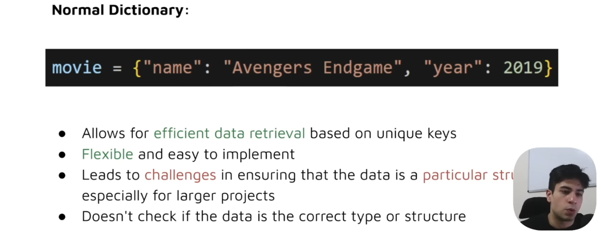

### Typed Dictionary

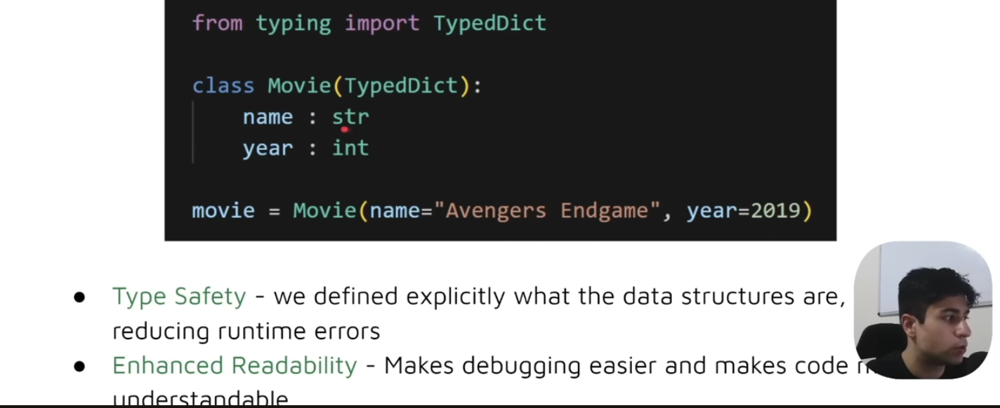

### Union

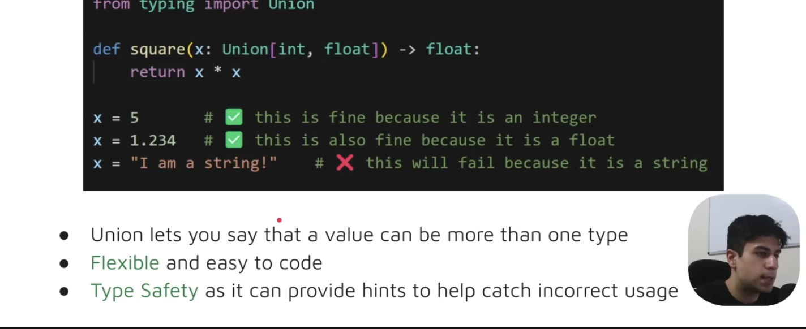

### Optional

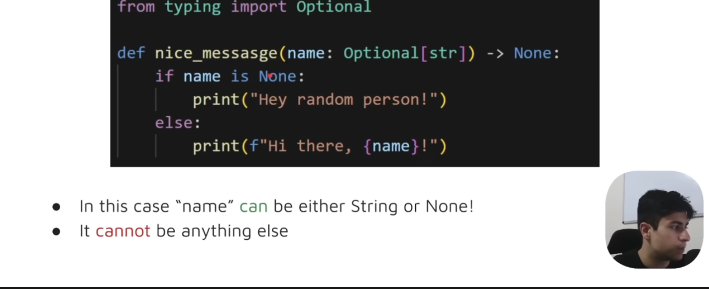

### Any

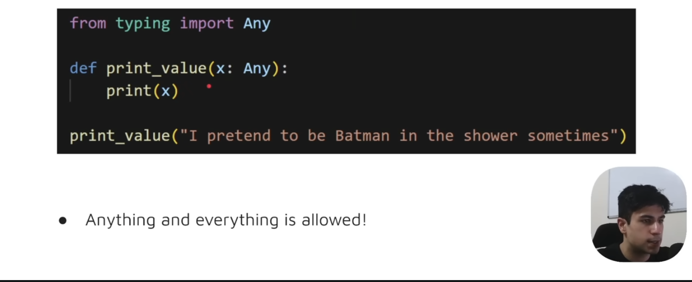

### Lambda Function

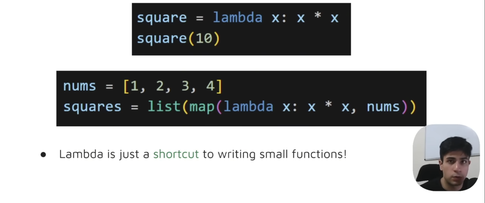

## Elemnets

### State

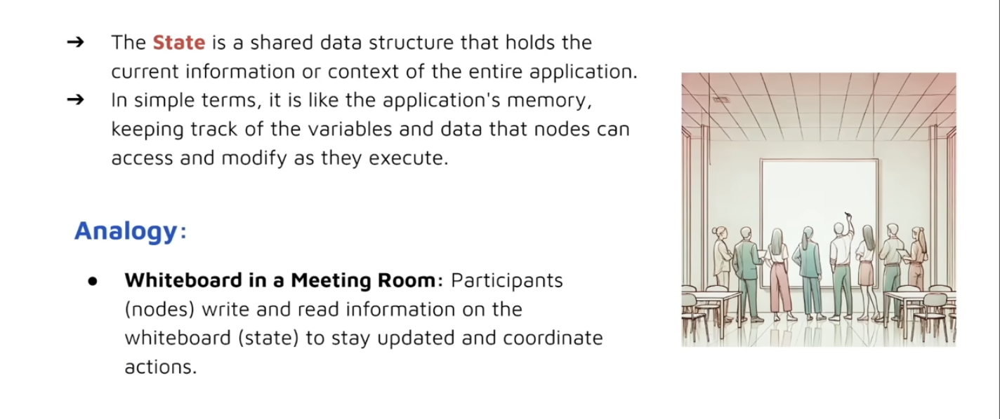

### Nodes

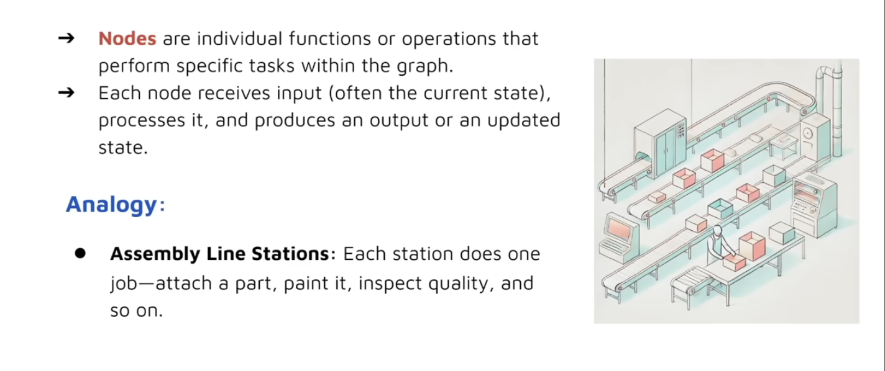

### **Graph**

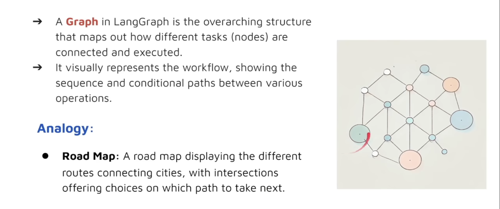

### Edges

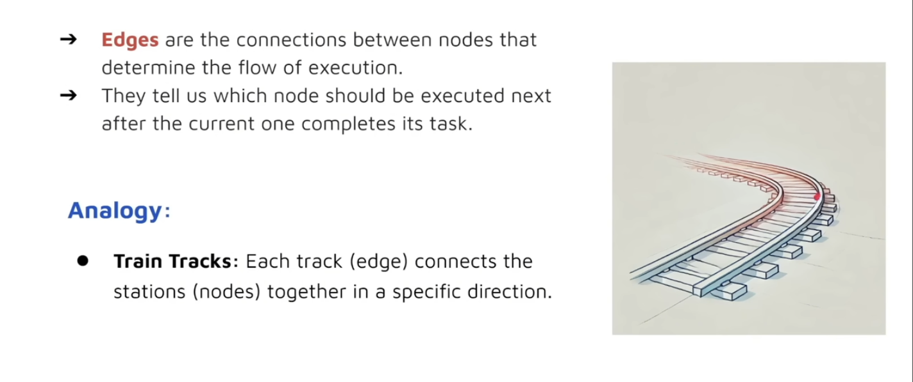

### Conditional Edges

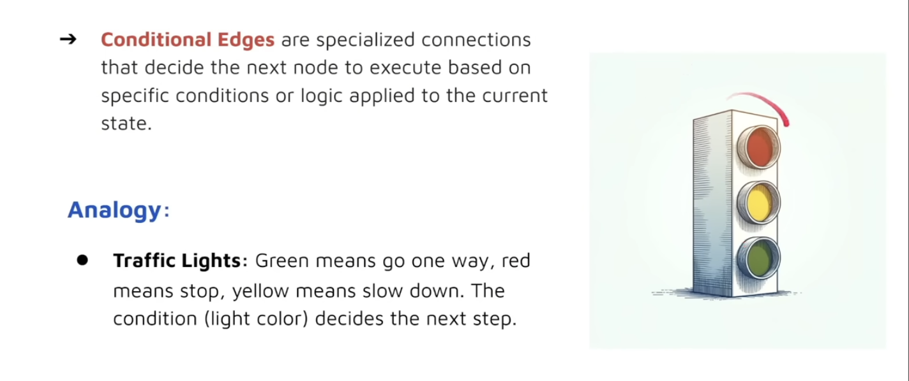

### START

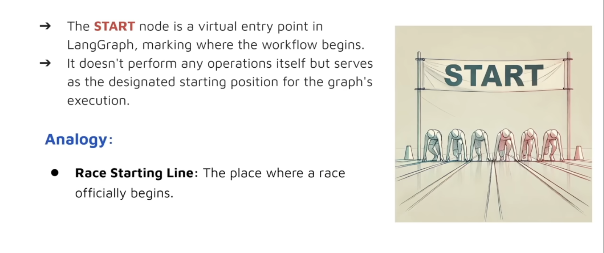

### END

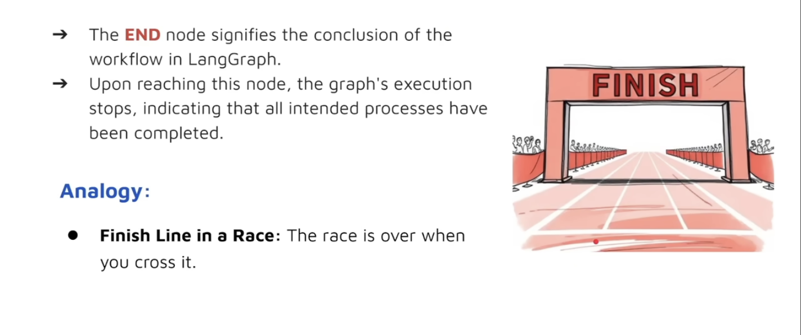

### Tools

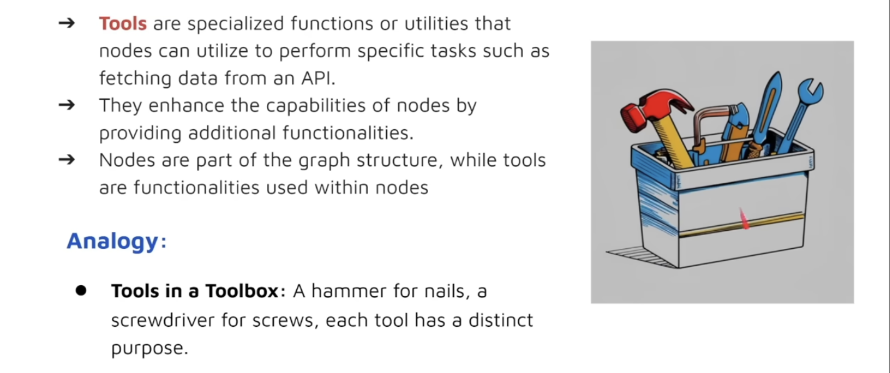

### ToolsNode

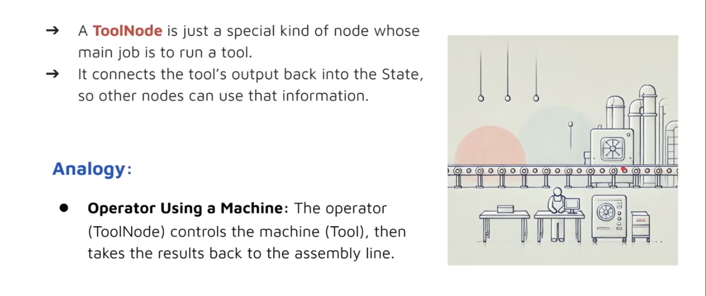

### StateGraph

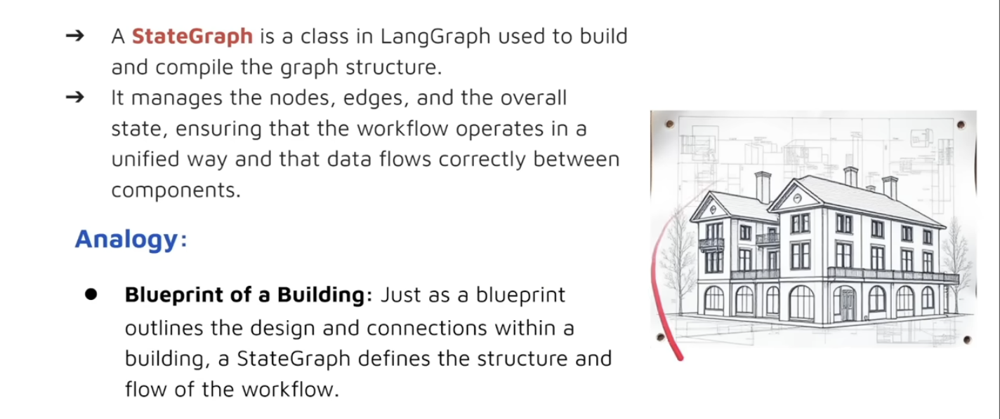

### Runnable

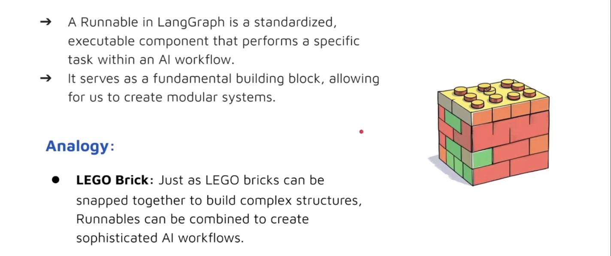

### Messages

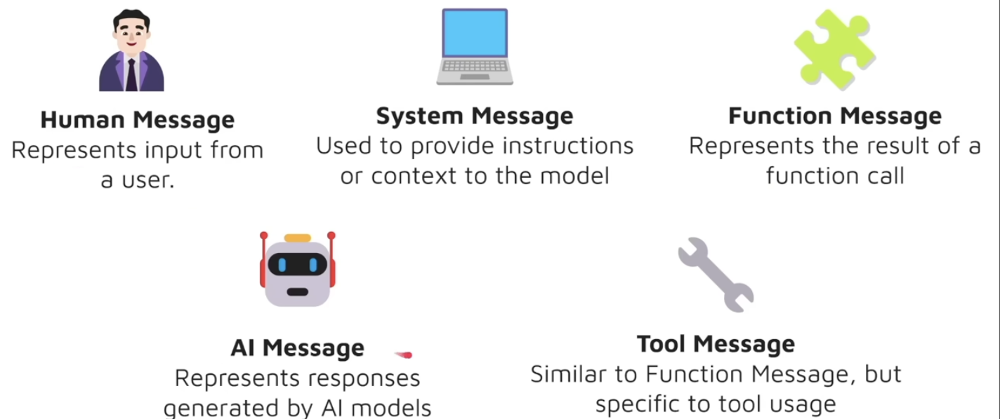

　　‍