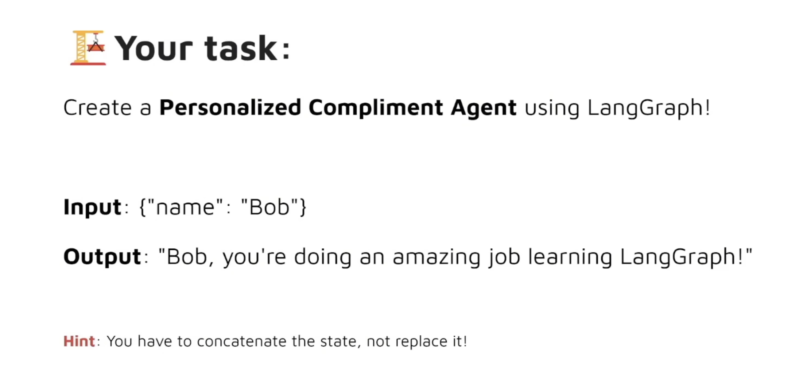

# Exercise  for Graph Ⅰ



```python
# %% [markdown]
# # Exercise 1
# 

# %%
from typing import Dict,TypedDict
from langgraph.graph import StateGraph

# %%
class AgentState(TypedDict):
    message:str
    
def greating_node(state:AgentState)->AgentState:
    '''Simple node that adds a greeting message to thr state'''
    
    state['message']=state['message']+",you`re doing an amazing job learning LangGraph"
    return state

# %%
gragh=StateGraph(AgentState)

gragh.add_node("greeter",greating_node)

gragh.set_entry_point("greeter")
gragh.set_finish_point("greeter")
app=gragh.compile()

# %%
from IPython.display import Image, display
display(Image(app.get_graph().draw_mermaid_png()))

# %%
result=app.invoke({"message":"Bob"})

# %%
result["message"]

# %%


```
