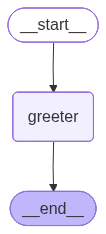

---
# 核心元数据
author: lanshi
date: "2025-01-02T12:00:00+08:00"
lastmod:
title: "Hello World Graph"

# 内容控制
draft: false
showToc: true
tocOpen: false
showFullContent: true
summary: 本文介绍了如何使用LangGraph构建一个简单的Hello World图。

# 内容分类
series:
tags: ["编程", "教程"]
categories: ["学习笔记"]

# SEO优化
description: 本文详细介绍了如何使用LangGraph构建一个简单的Hello World图。
keywords: ["LangGraph", "编程", "教程", "状态图", "Python"]

# 主题集成
math: true
comment: true
hiddenFromSearch: false
hiddenFromHomePage: false

# 视觉配置
cover:
  image: "assets/image-20251203215039-247z6zy.png"
  alt: "Hello World Graph封面"
  caption: "Hello World Graph封面"
  relative: true

# 版权声明
copyright: true
---

# Graph Ⅰ

# Hello World Graph


## 导入包

```Python
from typing import Dict,TypedDict
from langgraph.graph import StateGraph
```

## 定义状态

```Python
class AgentState(TypedDict):
    message:str
    
def greating_node(state:AgentState)->AgentState:
    '''Simple node that adds a greeting message to thr state'''
    
    state['message']="Hey "+state['message']+",how is your day going?"
    return state
```

## 构建图

```Python
gragh=StateGraph(AgentState)

gragh.add_node("greeter",greating_node)

gragh.set_entry_point("greeter")
gragh.set_finish_point("greeter")
app=gragh.compile()
from IPython.display import Image, display
display(Image(app.get_graph().draw_mermaid_png()))
```



## 调用

```Python
result=app.invoke({"message":"Bob"})
result["message"]
```

> 'Hey Bob,how is your day going?'

　　‍
